# 明代进士

## Graph 1: Total Count by Province

| Province | Count | Percentage |
|---|---:|---:|
| 直隶 | 3309 | 14.29% |
| 浙江 | 3272 | 14.13% |
| 江西 | 2417 | 10.44% |
| 未知 | 2309 | 9.97% |
| 福建 | 2186 | 9.44% |
| 河南 | 1577 | 6.81% |
| 山东 | 1465 | 6.33% |
| 湖广 | 1350 | 5.83% |
| 四川 | 1323 | 5.72% |
| 山西 | 1124 | 4.86% |
| 陕西 | 957 | 4.13% |
| 广东 | 755 | 3.26% |
| 南直隶 | 498 | 2.15% |
| 云南 | 242 | 1.05% |
| 广西 | 167 | 0.72% |
| 北直隶 | 108 | 0.47% |
| 贵州 | 90 | 0.39% |

## Graph 2: Yearly Count per Province

### 云南

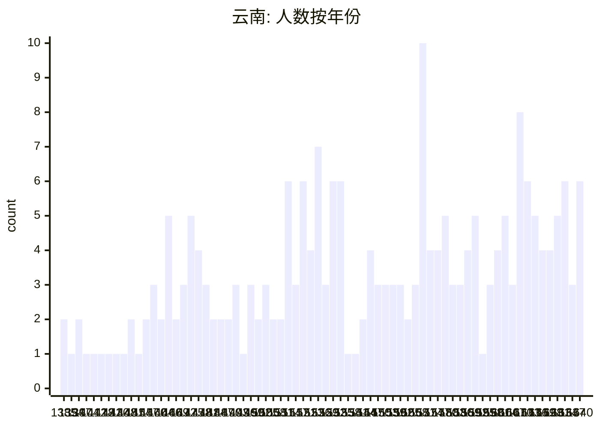
```mermaid
xychart-beta
    title "云南: 人数按年份"
    x-axis [1385, 1394, 1397, 1404, 1412, 1418, 1421, 1430, 1448, 1451, 1454, 1457, 1460, 1464, 1466, 1469, 1472, 1475, 1478, 1481, 1484, 1487, 1490, 1493, 1496, 1499, 1502, 1505, 1508, 1511, 1514, 1517, 1521, 1523, 1526, 1529, 1532, 1535, 1538, 1541, 1544, 1547, 1550, 1553, 1559, 1562, 1565, 1568, 1571, 1574, 1577, 1580, 1583, 1586, 1589, 1592, 1595, 1598, 1601, 1604, 1607, 1610, 1613, 1616, 1619, 1628, 1631, 1634, 1637, 1640]
    y-axis "count" 0 --> 10
    bar [2, 1, 2, 1, 1, 1, 1, 1, 1, 2, 1, 2, 3, 2, 5, 2, 3, 5, 4, 3, 2, 2, 2, 3, 1, 3, 2, 3, 2, 2, 6, 3, 6, 4, 7, 3, 6, 6, 1, 1, 2, 4, 3, 3, 3, 3, 2, 3, 10, 4, 4, 5, 3, 3, 4, 5, 1, 3, 4, 5, 3, 8, 6, 5, 4, 4, 5, 6, 3, 6]
```

### 北直隶

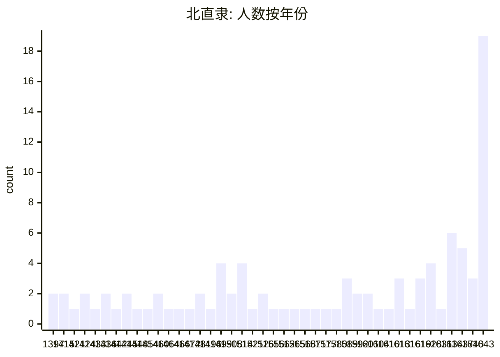
```mermaid
xychart-beta
    title "北直隶: 人数按年份"
    x-axis [1397, 1415, 1421, 1424, 1433, 1436, 1442, 1445, 1448, 1454, 1460, 1464, 1466, 1472, 1481, 1496, 1499, 1508, 1514, 1521, 1526, 1556, 1562, 1565, 1568, 1571, 1577, 1580, 1589, 1592, 1601, 1604, 1610, 1613, 1616, 1619, 1628, 1631, 1634, 1637, 1640, 1643]
    y-axis "count" 0 --> 19
    bar [2, 2, 1, 2, 1, 2, 1, 2, 1, 1, 2, 1, 1, 1, 2, 1, 4, 2, 4, 1, 2, 1, 1, 1, 1, 1, 1, 1, 3, 2, 2, 1, 1, 3, 1, 3, 4, 1, 6, 5, 3, 19]
```

### 南直隶

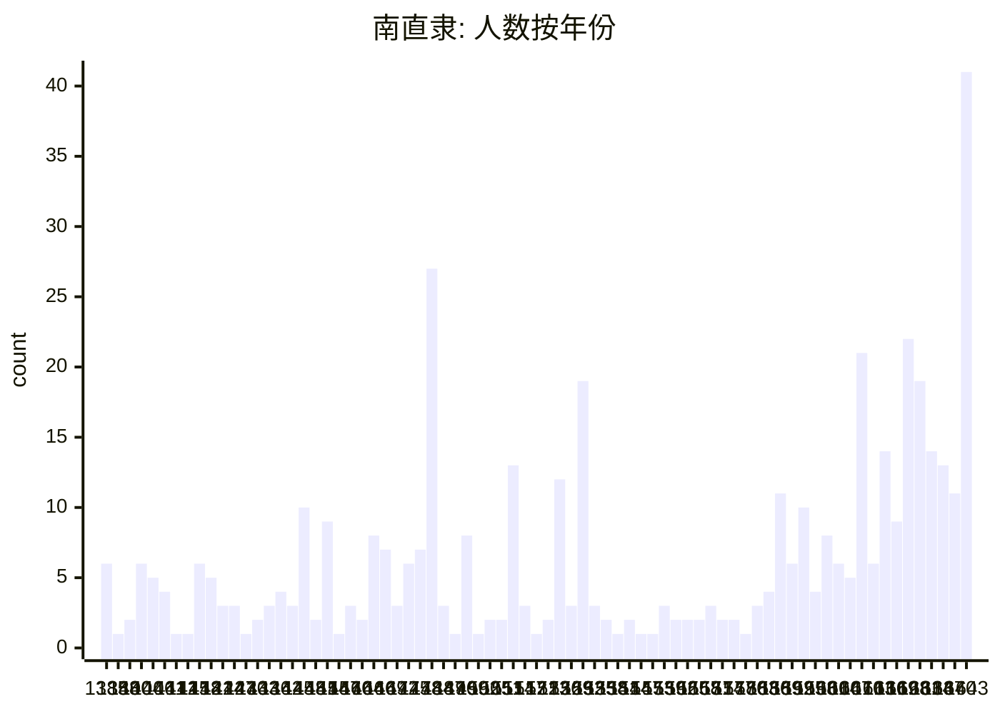
```mermaid
xychart-beta
    title "南直隶: 人数按年份"
    x-axis [1385, 1388, 1400, 1404, 1406, 1411, 1412, 1415, 1418, 1421, 1424, 1427, 1430, 1433, 1436, 1442, 1445, 1448, 1451, 1454, 1457, 1460, 1464, 1466, 1469, 1472, 1475, 1478, 1484, 1487, 1496, 1499, 1502, 1505, 1511, 1514, 1517, 1521, 1523, 1526, 1529, 1532, 1535, 1538, 1541, 1544, 1547, 1553, 1559, 1562, 1565, 1568, 1571, 1574, 1577, 1580, 1583, 1586, 1589, 1592, 1595, 1598, 1601, 1604, 1607, 1610, 1613, 1616, 1619, 1628, 1631, 1634, 1637, 1640, 1643]
    y-axis "count" 0 --> 41
    bar [6, 1, 2, 6, 5, 4, 1, 1, 6, 5, 3, 3, 1, 2, 3, 4, 3, 10, 2, 9, 1, 3, 2, 8, 7, 3, 6, 7, 27, 3, 1, 8, 1, 2, 2, 13, 3, 1, 2, 12, 3, 19, 3, 2, 1, 2, 1, 1, 3, 2, 2, 2, 3, 2, 2, 1, 3, 4, 11, 6, 10, 4, 8, 6, 5, 21, 6, 14, 9, 22, 19, 14, 13, 11, 41]
```

### 四川

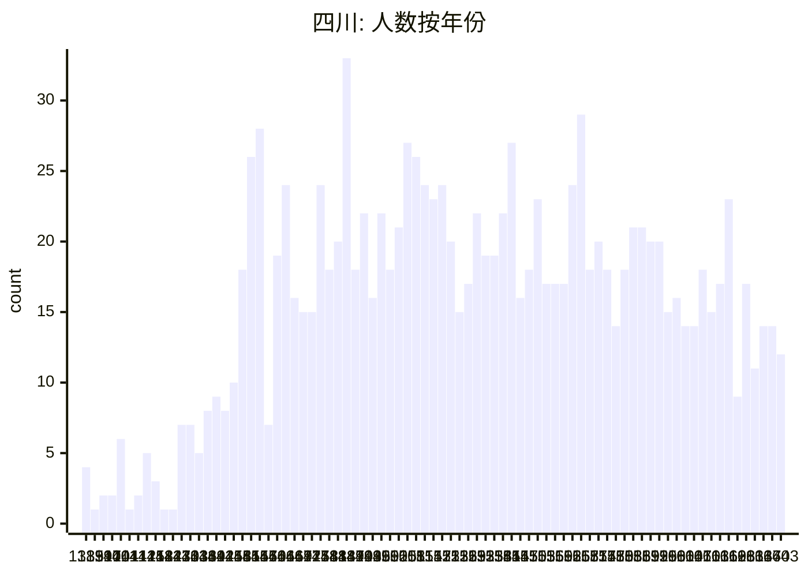
```mermaid
xychart-beta
    title "四川: 人数按年份"
    x-axis [1385, 1391, 1397, 1400, 1404, 1411, 1412, 1415, 1418, 1424, 1427, 1430, 1433, 1436, 1439, 1442, 1445, 1448, 1451, 1454, 1457, 1460, 1464, 1466, 1469, 1472, 1475, 1478, 1481, 1484, 1487, 1490, 1493, 1496, 1499, 1502, 1505, 1508, 1511, 1514, 1517, 1521, 1523, 1526, 1529, 1532, 1535, 1538, 1541, 1544, 1547, 1550, 1553, 1556, 1559, 1562, 1565, 1568, 1571, 1574, 1577, 1580, 1583, 1586, 1589, 1592, 1595, 1598, 1601, 1604, 1607, 1610, 1613, 1616, 1619, 1628, 1631, 1634, 1637, 1640, 1643]
    y-axis "count" 0 --> 33
    bar [4, 1, 2, 2, 6, 1, 2, 5, 3, 1, 1, 7, 7, 5, 8, 9, 8, 10, 18, 26, 28, 7, 19, 24, 16, 15, 15, 24, 18, 20, 33, 18, 22, 16, 22, 18, 21, 27, 26, 24, 23, 24, 20, 15, 17, 22, 19, 19, 22, 27, 16, 18, 23, 17, 17, 17, 24, 29, 18, 20, 18, 14, 18, 21, 21, 20, 20, 15, 16, 14, 14, 18, 15, 17, 23, 9, 17, 11, 14, 14, 12]
```

### 山东

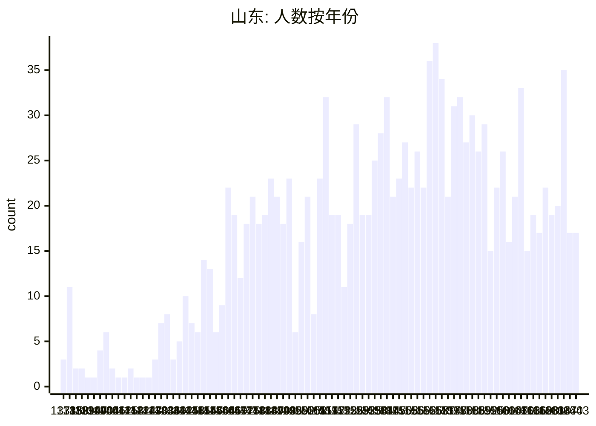
```mermaid
xychart-beta
    title "山东: 人数按年份"
    x-axis [1371, 1385, 1388, 1391, 1394, 1397, 1400, 1404, 1406, 1412, 1415, 1418, 1421, 1424, 1427, 1430, 1433, 1436, 1439, 1442, 1445, 1448, 1451, 1454, 1457, 1460, 1464, 1466, 1469, 1472, 1475, 1478, 1481, 1484, 1487, 1490, 1493, 1496, 1499, 1502, 1505, 1508, 1511, 1514, 1517, 1521, 1523, 1526, 1529, 1532, 1535, 1538, 1541, 1544, 1547, 1550, 1553, 1556, 1559, 1562, 1565, 1568, 1571, 1574, 1577, 1580, 1583, 1586, 1589, 1592, 1595, 1598, 1601, 1604, 1607, 1610, 1613, 1616, 1619, 1628, 1631, 1634, 1637, 1640, 1643]
    y-axis "count" 0 --> 38
    bar [3, 11, 2, 2, 1, 1, 4, 6, 2, 1, 1, 2, 1, 1, 1, 3, 7, 8, 3, 5, 10, 7, 6, 14, 13, 6, 9, 22, 19, 12, 18, 21, 18, 19, 23, 21, 18, 23, 6, 16, 21, 8, 23, 32, 19, 19, 11, 18, 29, 19, 19, 25, 28, 32, 21, 23, 27, 22, 26, 22, 36, 38, 34, 21, 31, 32, 27, 30, 26, 29, 15, 22, 26, 16, 21, 33, 15, 19, 17, 22, 19, 20, 35, 17, 17]
```

### 山西

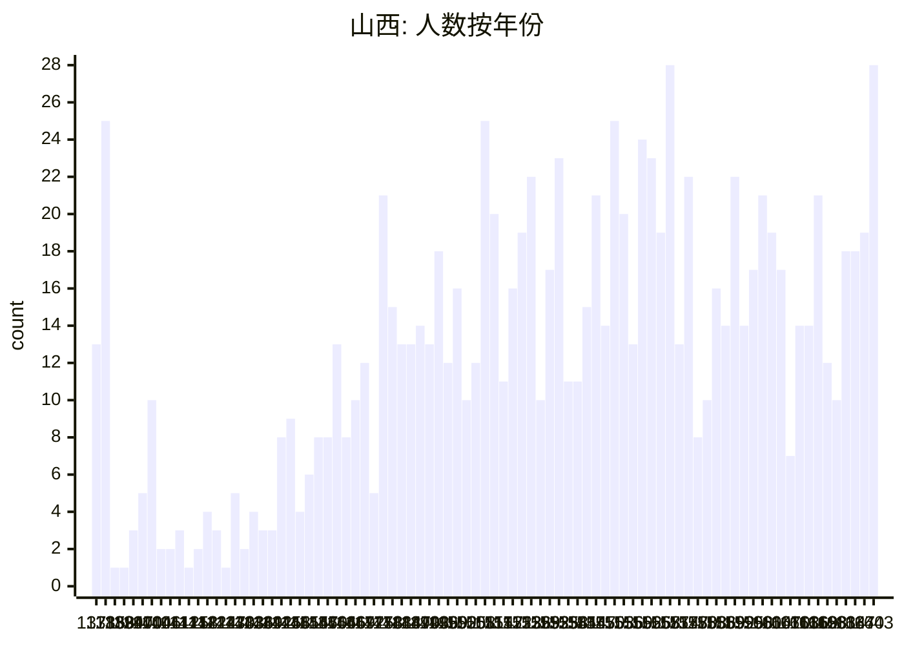
```mermaid
xychart-beta
    title "山西: 人数按年份"
    x-axis [1371, 1385, 1388, 1394, 1397, 1400, 1404, 1406, 1411, 1412, 1415, 1418, 1421, 1424, 1427, 1430, 1433, 1436, 1439, 1442, 1445, 1448, 1451, 1454, 1457, 1460, 1464, 1466, 1469, 1472, 1475, 1478, 1481, 1484, 1487, 1490, 1493, 1496, 1499, 1502, 1505, 1508, 1511, 1514, 1517, 1521, 1523, 1526, 1529, 1532, 1535, 1538, 1541, 1544, 1547, 1550, 1553, 1556, 1559, 1562, 1565, 1568, 1571, 1574, 1577, 1580, 1583, 1586, 1589, 1592, 1595, 1598, 1601, 1604, 1607, 1610, 1613, 1616, 1619, 1628, 1631, 1634, 1637, 1640, 1643]
    y-axis "count" 0 --> 28
    bar [13, 25, 1, 1, 3, 5, 10, 2, 2, 3, 1, 2, 4, 3, 1, 5, 2, 4, 3, 3, 8, 9, 4, 6, 8, 8, 13, 8, 10, 12, 5, 21, 15, 13, 13, 14, 13, 18, 12, 16, 10, 12, 25, 20, 11, 16, 19, 22, 10, 17, 23, 11, 11, 15, 21, 14, 25, 20, 13, 24, 23, 19, 28, 13, 22, 8, 10, 16, 14, 22, 14, 17, 21, 19, 17, 7, 14, 14, 21, 12, 10, 18, 18, 19, 28]
```

### 广东

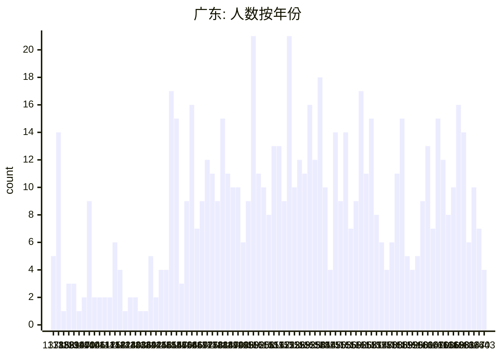
```mermaid
xychart-beta
    title "广东: 人数按年份"
    x-axis [1371, 1385, 1388, 1391, 1394, 1397, 1400, 1404, 1406, 1411, 1412, 1415, 1418, 1421, 1424, 1430, 1433, 1436, 1439, 1442, 1445, 1448, 1451, 1454, 1457, 1460, 1464, 1466, 1469, 1472, 1475, 1478, 1481, 1484, 1487, 1490, 1493, 1496, 1499, 1502, 1505, 1508, 1511, 1514, 1517, 1521, 1523, 1526, 1529, 1532, 1535, 1538, 1541, 1544, 1547, 1550, 1553, 1556, 1559, 1562, 1565, 1568, 1571, 1574, 1577, 1580, 1583, 1586, 1589, 1592, 1595, 1598, 1601, 1604, 1607, 1610, 1613, 1616, 1619, 1628, 1631, 1634, 1637, 1640, 1643]
    y-axis "count" 0 --> 21
    bar [5, 14, 1, 3, 3, 1, 2, 9, 2, 2, 2, 2, 6, 4, 1, 2, 2, 1, 1, 5, 2, 4, 4, 17, 15, 3, 9, 16, 7, 9, 12, 11, 9, 15, 11, 10, 10, 6, 9, 21, 11, 10, 8, 13, 13, 9, 21, 10, 12, 11, 16, 12, 18, 10, 4, 14, 9, 14, 7, 9, 17, 11, 15, 8, 6, 4, 6, 11, 15, 5, 4, 5, 9, 13, 7, 15, 12, 8, 10, 16, 14, 6, 10, 7, 4]
```

### 广西

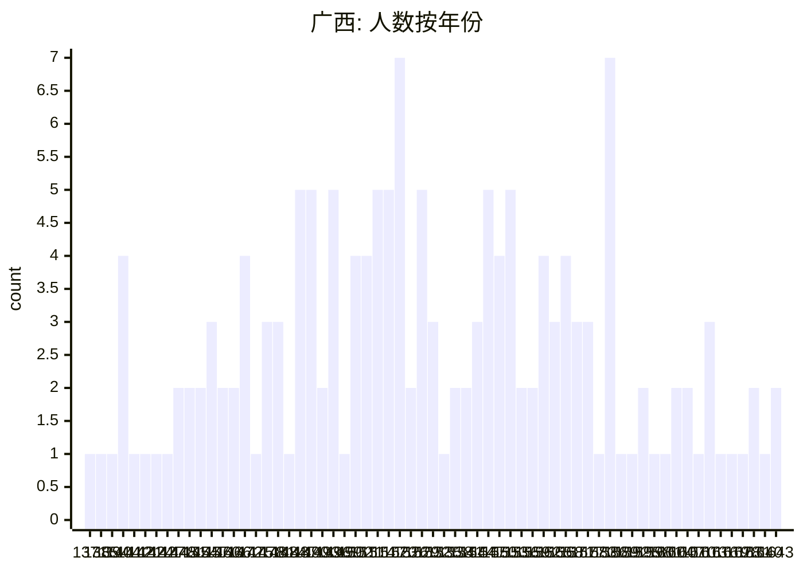
```mermaid
xychart-beta
    title "广西: 人数按年份"
    x-axis [1371, 1385, 1394, 1404, 1412, 1421, 1424, 1427, 1448, 1451, 1454, 1457, 1460, 1466, 1472, 1475, 1478, 1481, 1484, 1487, 1490, 1493, 1496, 1499, 1502, 1511, 1514, 1517, 1523, 1526, 1529, 1532, 1535, 1538, 1541, 1544, 1547, 1550, 1553, 1556, 1559, 1562, 1565, 1568, 1571, 1577, 1583, 1586, 1589, 1592, 1595, 1598, 1601, 1604, 1607, 1610, 1613, 1616, 1619, 1628, 1631, 1640, 1643]
    y-axis "count" 0 --> 7
    bar [1, 1, 1, 4, 1, 1, 1, 1, 2, 2, 2, 3, 2, 2, 4, 1, 3, 3, 1, 5, 5, 2, 5, 1, 4, 4, 5, 5, 7, 2, 5, 3, 1, 2, 2, 3, 5, 4, 5, 2, 2, 4, 3, 4, 3, 3, 1, 7, 1, 1, 2, 1, 1, 2, 2, 1, 3, 1, 1, 1, 2, 1, 2]
```

### 未知

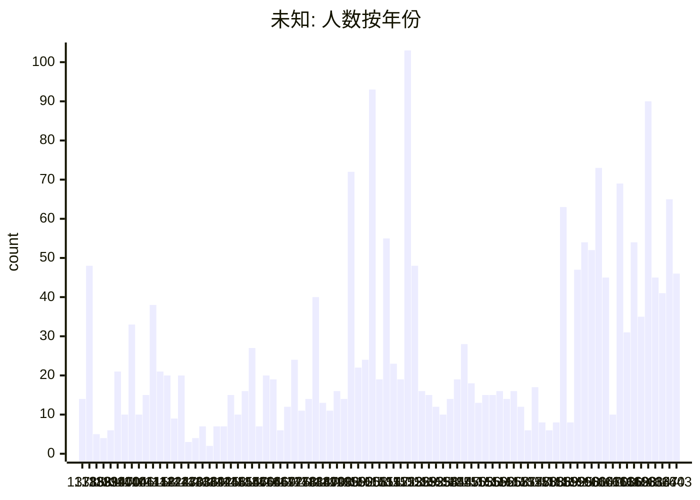
```mermaid
xychart-beta
    title "未知: 人数按年份"
    x-axis [1371, 1385, 1388, 1391, 1394, 1397, 1400, 1404, 1406, 1411, 1415, 1418, 1421, 1424, 1427, 1430, 1433, 1436, 1439, 1442, 1445, 1448, 1451, 1454, 1457, 1460, 1464, 1466, 1469, 1472, 1475, 1478, 1481, 1484, 1487, 1490, 1493, 1496, 1499, 1502, 1505, 1508, 1511, 1514, 1517, 1521, 1523, 1526, 1529, 1532, 1535, 1538, 1541, 1544, 1547, 1550, 1553, 1556, 1559, 1562, 1565, 1568, 1571, 1574, 1577, 1580, 1583, 1586, 1589, 1592, 1595, 1598, 1601, 1604, 1607, 1610, 1613, 1616, 1619, 1628, 1631, 1634, 1637, 1640, 1643]
    y-axis "count" 0 --> 103
    bar [14, 48, 5, 4, 6, 21, 10, 33, 10, 15, 38, 21, 20, 9, 20, 3, 4, 7, 2, 7, 7, 15, 10, 16, 27, 7, 20, 19, 6, 12, 24, 11, 14, 40, 13, 11, 16, 14, 72, 22, 24, 93, 19, 55, 23, 19, 103, 48, 16, 15, 12, 10, 14, 19, 28, 18, 13, 15, 15, 16, 14, 16, 12, 6, 17, 8, 6, 8, 63, 8, 47, 54, 52, 73, 45, 10, 69, 31, 54, 35, 90, 45, 41, 65, 46]
```

### 江西

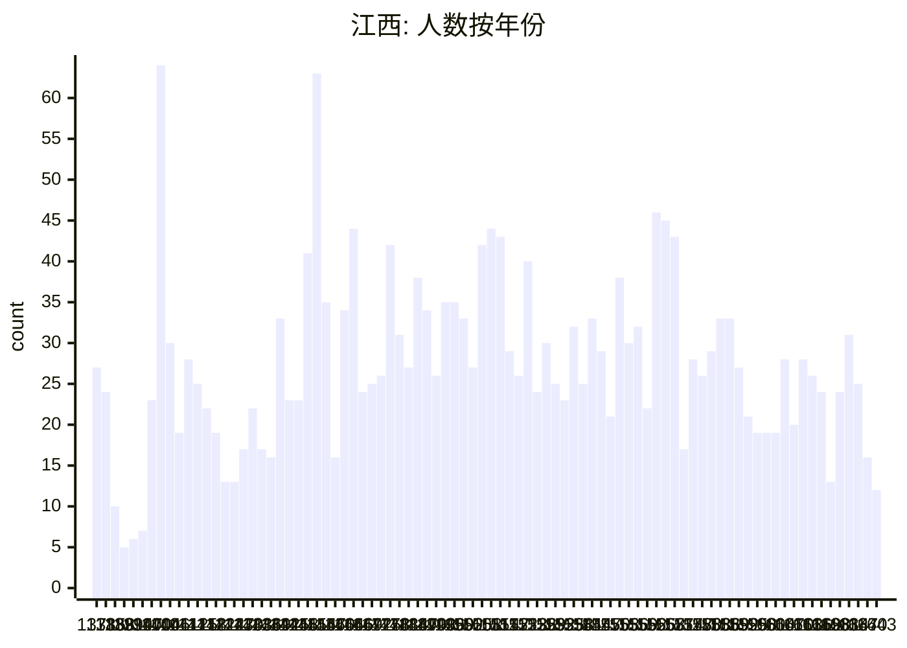
```mermaid
xychart-beta
    title "江西: 人数按年份"
    x-axis [1371, 1385, 1388, 1391, 1394, 1397, 1400, 1404, 1406, 1411, 1412, 1415, 1418, 1421, 1424, 1427, 1430, 1433, 1436, 1439, 1442, 1445, 1448, 1451, 1454, 1457, 1460, 1464, 1466, 1469, 1472, 1475, 1478, 1481, 1484, 1487, 1490, 1493, 1496, 1499, 1502, 1505, 1508, 1511, 1514, 1517, 1521, 1523, 1526, 1529, 1532, 1535, 1538, 1541, 1544, 1547, 1550, 1553, 1556, 1559, 1562, 1565, 1568, 1571, 1574, 1577, 1580, 1583, 1586, 1589, 1592, 1595, 1598, 1601, 1604, 1607, 1610, 1613, 1616, 1619, 1628, 1631, 1634, 1637, 1640, 1643]
    y-axis "count" 0 --> 64
    bar [27, 24, 10, 5, 6, 7, 23, 64, 30, 19, 28, 25, 22, 19, 13, 13, 17, 22, 17, 16, 33, 23, 23, 41, 63, 35, 16, 34, 44, 24, 25, 26, 42, 31, 27, 38, 34, 26, 35, 35, 33, 27, 42, 44, 43, 29, 26, 40, 24, 30, 25, 23, 32, 25, 33, 29, 21, 38, 30, 32, 22, 46, 45, 43, 17, 28, 26, 29, 33, 33, 27, 21, 19, 19, 19, 28, 20, 28, 26, 24, 13, 24, 31, 25, 16, 12]
```

### 河南

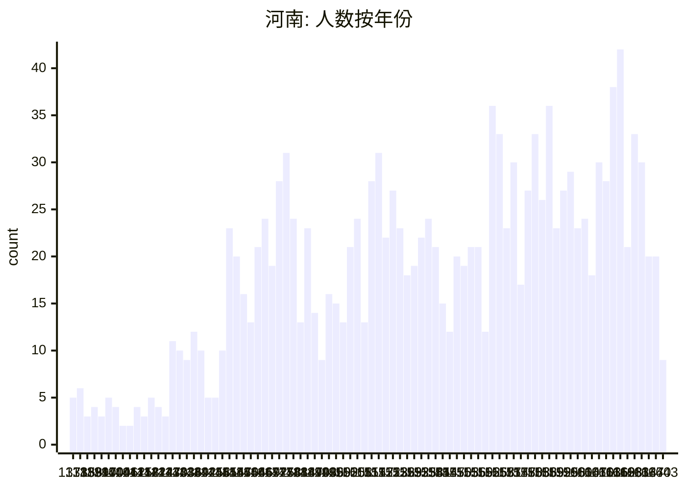
```mermaid
xychart-beta
    title "河南: 人数按年份"
    x-axis [1371, 1385, 1388, 1391, 1397, 1400, 1404, 1406, 1412, 1415, 1418, 1421, 1424, 1427, 1430, 1433, 1436, 1439, 1442, 1445, 1448, 1451, 1454, 1457, 1460, 1464, 1466, 1469, 1472, 1475, 1478, 1481, 1484, 1487, 1490, 1493, 1496, 1499, 1502, 1505, 1508, 1511, 1514, 1517, 1521, 1523, 1526, 1529, 1532, 1535, 1538, 1541, 1544, 1547, 1550, 1553, 1556, 1559, 1562, 1565, 1568, 1571, 1574, 1577, 1580, 1583, 1586, 1589, 1592, 1595, 1598, 1601, 1604, 1607, 1610, 1613, 1616, 1619, 1628, 1631, 1634, 1637, 1640, 1643]
    y-axis "count" 0 --> 42
    bar [5, 6, 3, 4, 3, 5, 4, 2, 2, 4, 3, 5, 4, 3, 11, 10, 9, 12, 10, 5, 5, 10, 23, 20, 16, 13, 21, 24, 19, 28, 31, 24, 13, 23, 14, 9, 16, 15, 13, 21, 24, 13, 28, 31, 22, 27, 23, 18, 19, 22, 24, 21, 15, 12, 20, 19, 21, 21, 12, 36, 33, 23, 30, 17, 27, 33, 26, 36, 23, 27, 29, 23, 24, 18, 30, 28, 38, 42, 21, 33, 30, 20, 20, 9]
```

### 浙江

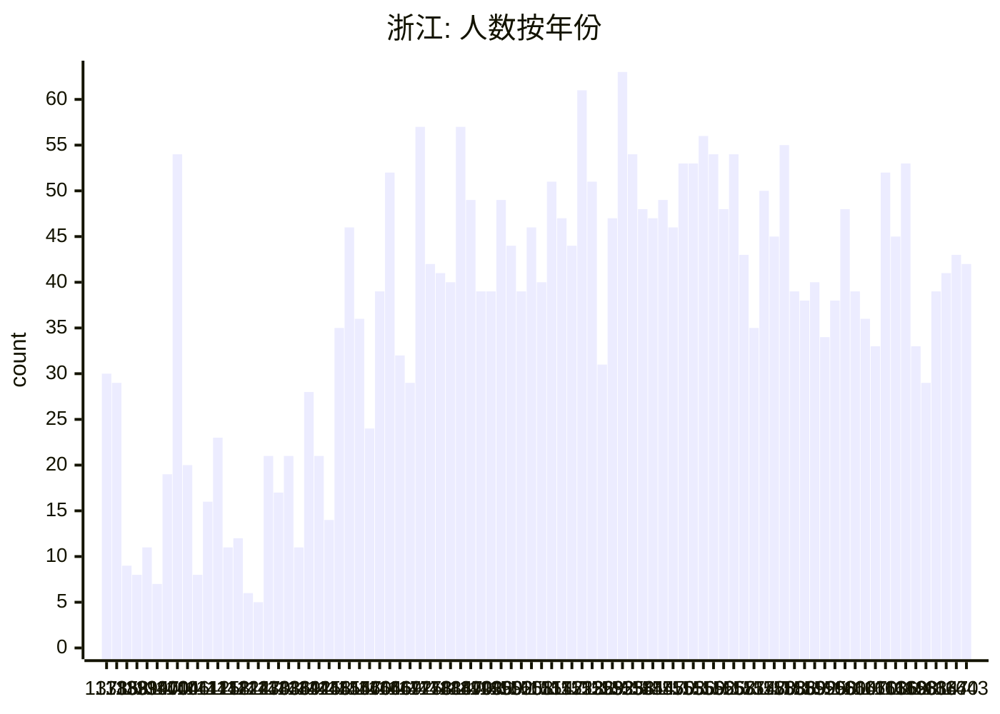
```mermaid
xychart-beta
    title "浙江: 人数按年份"
    x-axis [1371, 1385, 1388, 1391, 1394, 1397, 1400, 1404, 1406, 1411, 1412, 1415, 1418, 1421, 1424, 1427, 1430, 1433, 1436, 1439, 1442, 1445, 1448, 1451, 1454, 1457, 1460, 1464, 1466, 1469, 1472, 1475, 1478, 1481, 1484, 1487, 1490, 1493, 1496, 1499, 1502, 1505, 1508, 1511, 1514, 1517, 1521, 1523, 1526, 1529, 1532, 1535, 1538, 1541, 1544, 1547, 1550, 1553, 1556, 1559, 1562, 1565, 1568, 1571, 1574, 1577, 1580, 1583, 1586, 1589, 1592, 1595, 1598, 1601, 1604, 1607, 1610, 1613, 1616, 1619, 1628, 1631, 1634, 1637, 1640, 1643]
    y-axis "count" 0 --> 63
    bar [30, 29, 9, 8, 11, 7, 19, 54, 20, 8, 16, 23, 11, 12, 6, 5, 21, 17, 21, 11, 28, 21, 14, 35, 46, 36, 24, 39, 52, 32, 29, 57, 42, 41, 40, 57, 49, 39, 39, 49, 44, 39, 46, 40, 51, 47, 44, 61, 51, 31, 47, 63, 54, 48, 47, 49, 46, 53, 53, 56, 54, 48, 54, 43, 35, 50, 45, 55, 39, 38, 40, 34, 38, 48, 39, 36, 33, 52, 45, 53, 33, 29, 39, 41, 43, 42]
```

### 湖广

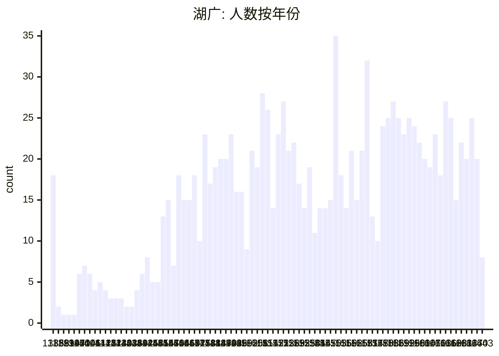
```mermaid
xychart-beta
    title "湖广: 人数按年份"
    x-axis [1385, 1388, 1391, 1394, 1397, 1400, 1404, 1406, 1411, 1412, 1415, 1421, 1424, 1430, 1433, 1436, 1439, 1442, 1445, 1448, 1451, 1454, 1457, 1460, 1464, 1466, 1469, 1472, 1475, 1478, 1481, 1484, 1487, 1490, 1493, 1496, 1499, 1502, 1505, 1508, 1511, 1514, 1517, 1521, 1523, 1526, 1529, 1532, 1535, 1538, 1541, 1544, 1547, 1550, 1553, 1556, 1559, 1562, 1565, 1568, 1571, 1574, 1577, 1580, 1583, 1586, 1589, 1592, 1595, 1598, 1601, 1604, 1607, 1610, 1613, 1616, 1619, 1628, 1631, 1634, 1637, 1640, 1643]
    y-axis "count" 0 --> 35
    bar [18, 2, 1, 1, 1, 6, 7, 6, 4, 5, 4, 3, 3, 3, 2, 2, 4, 6, 8, 5, 5, 13, 15, 7, 18, 15, 15, 18, 10, 23, 17, 19, 20, 20, 23, 16, 16, 9, 21, 19, 28, 26, 14, 23, 27, 21, 22, 17, 14, 19, 11, 14, 14, 15, 35, 18, 14, 21, 15, 21, 32, 13, 10, 24, 25, 27, 25, 23, 25, 24, 22, 20, 19, 23, 18, 27, 25, 15, 22, 20, 25, 20, 8]
```

### 直隶

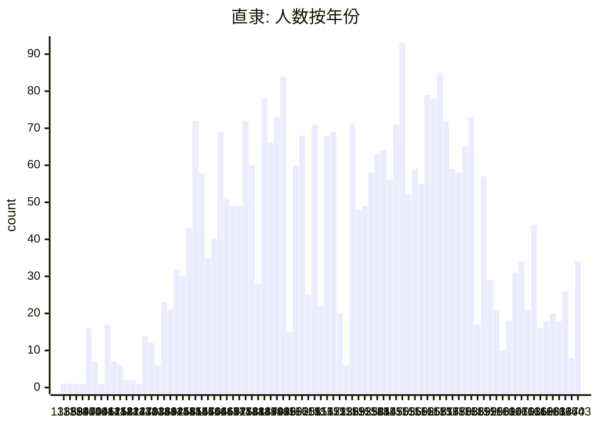
```mermaid
xychart-beta
    title "直隶: 人数按年份"
    x-axis [1385, 1388, 1394, 1397, 1400, 1404, 1406, 1412, 1415, 1418, 1421, 1424, 1427, 1430, 1433, 1436, 1439, 1442, 1445, 1448, 1451, 1454, 1457, 1460, 1464, 1466, 1469, 1472, 1475, 1478, 1481, 1484, 1487, 1490, 1493, 1496, 1499, 1502, 1505, 1508, 1511, 1514, 1517, 1521, 1523, 1526, 1529, 1532, 1535, 1538, 1541, 1544, 1547, 1550, 1553, 1556, 1559, 1562, 1565, 1568, 1571, 1574, 1577, 1580, 1583, 1586, 1589, 1592, 1595, 1598, 1601, 1604, 1607, 1610, 1613, 1616, 1619, 1628, 1631, 1634, 1637, 1640, 1643]
    y-axis "count" 0 --> 93
    bar [1, 1, 1, 1, 16, 7, 1, 17, 7, 6, 2, 2, 1, 14, 12, 6, 23, 21, 32, 30, 43, 72, 58, 35, 40, 69, 51, 49, 49, 72, 60, 28, 78, 66, 73, 84, 15, 60, 68, 25, 71, 22, 68, 69, 20, 6, 71, 48, 49, 58, 63, 64, 56, 71, 93, 52, 59, 55, 79, 78, 85, 72, 59, 58, 65, 73, 17, 57, 29, 21, 10, 18, 31, 34, 21, 44, 16, 18, 20, 18, 26, 8, 34]
```

### 福建

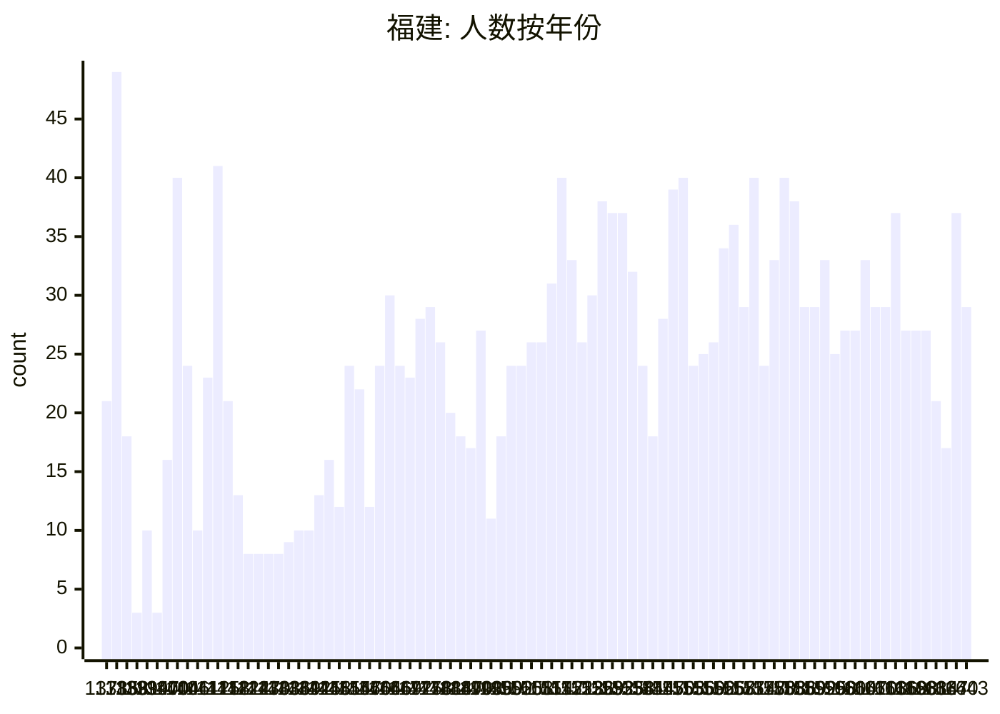
```mermaid
xychart-beta
    title "福建: 人数按年份"
    x-axis [1371, 1385, 1388, 1391, 1394, 1397, 1400, 1404, 1406, 1411, 1412, 1415, 1418, 1421, 1424, 1427, 1430, 1433, 1436, 1439, 1442, 1445, 1448, 1451, 1454, 1457, 1460, 1464, 1466, 1469, 1472, 1475, 1478, 1481, 1484, 1487, 1490, 1493, 1496, 1499, 1502, 1505, 1508, 1511, 1514, 1517, 1521, 1523, 1526, 1529, 1532, 1535, 1538, 1541, 1544, 1547, 1550, 1553, 1556, 1559, 1562, 1565, 1568, 1571, 1574, 1577, 1580, 1583, 1586, 1589, 1592, 1595, 1598, 1601, 1604, 1607, 1610, 1613, 1616, 1619, 1628, 1631, 1634, 1637, 1640, 1643]
    y-axis "count" 0 --> 49
    bar [21, 49, 18, 3, 10, 3, 16, 40, 24, 10, 23, 41, 21, 13, 8, 8, 8, 8, 9, 10, 10, 13, 16, 12, 24, 22, 12, 24, 30, 24, 23, 28, 29, 26, 20, 18, 17, 27, 11, 18, 24, 24, 26, 26, 31, 40, 33, 26, 30, 38, 37, 37, 32, 24, 18, 28, 39, 40, 24, 25, 26, 34, 36, 29, 40, 24, 33, 40, 38, 29, 29, 33, 25, 27, 27, 33, 29, 29, 37, 27, 27, 27, 21, 17, 37, 29]
```

### 贵州

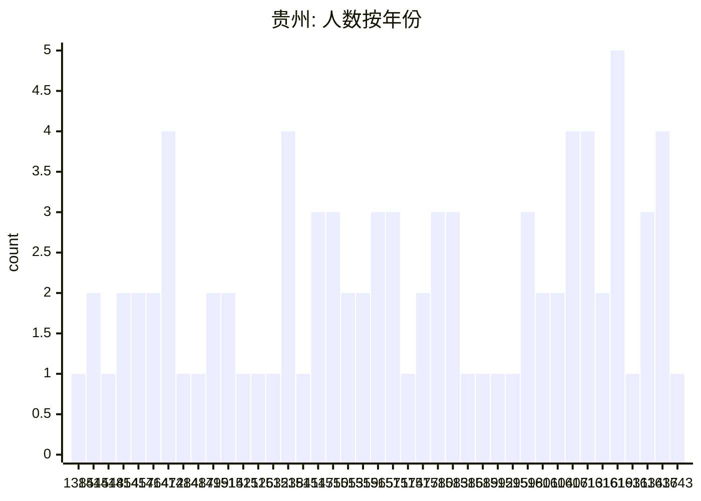
```mermaid
xychart-beta
    title "贵州: 人数按年份"
    x-axis [1385, 1445, 1448, 1454, 1457, 1464, 1472, 1484, 1487, 1499, 1514, 1521, 1526, 1532, 1538, 1541, 1547, 1550, 1553, 1559, 1565, 1571, 1574, 1577, 1580, 1583, 1586, 1589, 1592, 1595, 1598, 1601, 1604, 1607, 1613, 1616, 1619, 1631, 1634, 1637, 1643]
    y-axis "count" 0 --> 5
    bar [1, 2, 1, 2, 2, 2, 4, 1, 1, 2, 2, 1, 1, 1, 4, 1, 3, 3, 2, 2, 3, 3, 1, 2, 3, 3, 1, 1, 1, 1, 3, 2, 2, 4, 4, 2, 5, 1, 3, 4, 1]
```

### 陕西

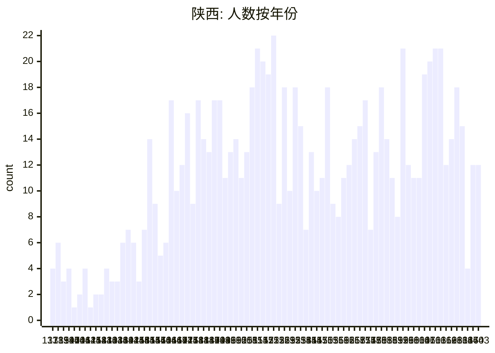
```mermaid
xychart-beta
    title "陕西: 人数按年份"
    x-axis [1371, 1385, 1394, 1397, 1404, 1406, 1412, 1415, 1418, 1421, 1430, 1433, 1436, 1439, 1442, 1445, 1448, 1451, 1454, 1457, 1460, 1464, 1466, 1469, 1472, 1475, 1478, 1481, 1484, 1487, 1490, 1493, 1496, 1499, 1502, 1505, 1508, 1511, 1514, 1517, 1521, 1523, 1526, 1529, 1532, 1535, 1538, 1541, 1544, 1547, 1550, 1553, 1556, 1559, 1562, 1565, 1568, 1571, 1574, 1577, 1580, 1583, 1586, 1589, 1592, 1595, 1598, 1601, 1604, 1607, 1610, 1613, 1616, 1619, 1628, 1631, 1634, 1637, 1640, 1643]
    y-axis "count" 0 --> 22
    bar [4, 6, 3, 4, 1, 2, 4, 1, 2, 2, 4, 3, 3, 6, 7, 6, 3, 7, 14, 9, 5, 6, 17, 10, 12, 16, 9, 17, 14, 13, 17, 17, 11, 13, 14, 11, 13, 18, 21, 20, 19, 22, 9, 18, 10, 18, 15, 7, 13, 10, 11, 18, 9, 8, 11, 12, 14, 15, 17, 7, 13, 18, 14, 11, 8, 21, 12, 11, 11, 19, 20, 21, 21, 12, 14, 18, 15, 4, 12, 12]
```
