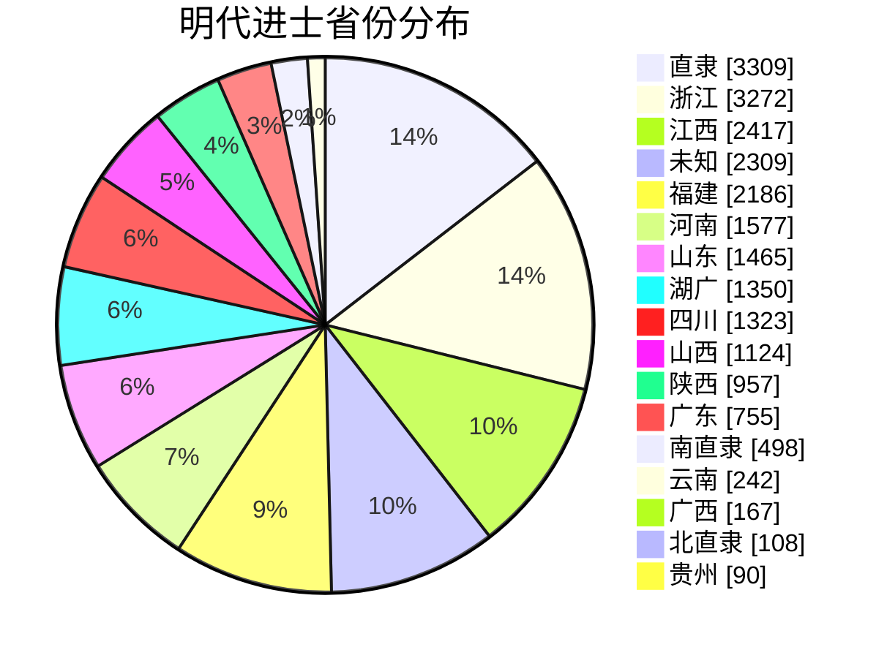

# Graph 1: Total Count by Province

```mermaid
pie showData
    title 明代进士省份分布
    "直隶" : 3309
    "浙江" : 3272
    "江西" : 2417
    "未知" : 2309
    "福建" : 2186
    "河南" : 1577
    "山东" : 1465
    "湖广" : 1350
    "四川" : 1323
    "山西" : 1124
    "陕西" : 957
    "广东" : 755
    "南直隶" : 498
    "云南" : 242
    "广西" : 167
    "北直隶" : 108
    "贵州" : 90
```
