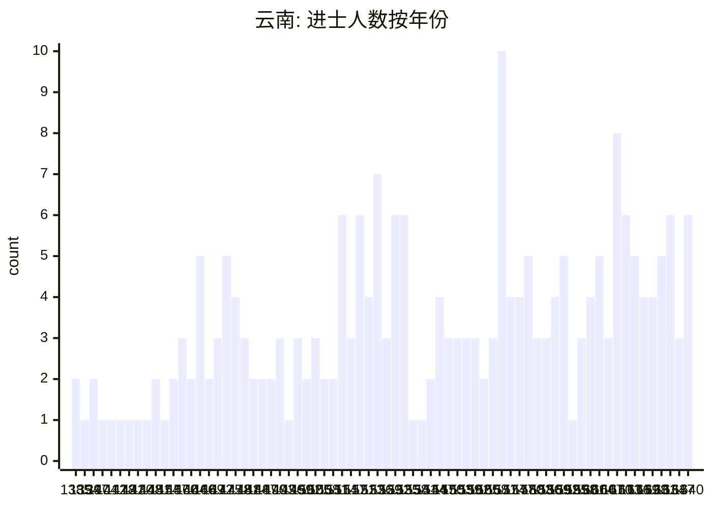
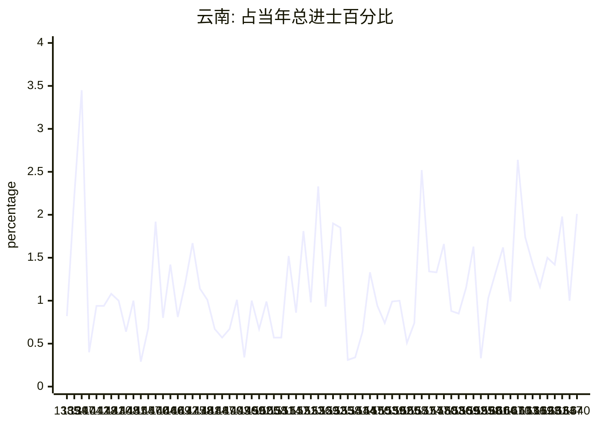

# Graph: 云南 Yearly Count

```mermaid
xychart-beta
    title "云南: 进士人数按年份"
    x-axis [1385, 1394, 1397, 1404, 1412, 1418, 1421, 1430, 1448, 1451, 1454, 1457, 1460, 1464, 1466, 1469, 1472, 1475, 1478, 1481, 1484, 1487, 1490, 1493, 1496, 1499, 1502, 1505, 1508, 1511, 1514, 1517, 1521, 1523, 1526, 1529, 1532, 1535, 1538, 1541, 1544, 1547, 1550, 1553, 1559, 1562, 1565, 1568, 1571, 1574, 1577, 1580, 1583, 1586, 1589, 1592, 1595, 1598, 1601, 1604, 1607, 1610, 1613, 1616, 1619, 1628, 1631, 1634, 1637, 1640]
    y-axis "count" 0 --> 10
    bar [2, 1, 2, 1, 1, 1, 1, 1, 1, 2, 1, 2, 3, 2, 5, 2, 3, 5, 4, 3, 2, 2, 2, 3, 1, 3, 2, 3, 2, 2, 6, 3, 6, 4, 7, 3, 6, 6, 1, 1, 2, 4, 3, 3, 3, 3, 2, 3, 10, 4, 4, 5, 3, 3, 4, 5, 1, 3, 4, 5, 3, 8, 6, 5, 4, 4, 5, 6, 3, 6]
```

```mermaid
xychart-beta
    title "云南: 占当年总进士百分比"
    x-axis [1385, 1394, 1397, 1404, 1412, 1418, 1421, 1430, 1448, 1451, 1454, 1457, 1460, 1464, 1466, 1469, 1472, 1475, 1478, 1481, 1484, 1487, 1490, 1493, 1496, 1499, 1502, 1505, 1508, 1511, 1514, 1517, 1521, 1523, 1526, 1529, 1532, 1535, 1538, 1541, 1544, 1547, 1550, 1553, 1559, 1562, 1565, 1568, 1571, 1574, 1577, 1580, 1583, 1586, 1589, 1592, 1595, 1598, 1601, 1604, 1607, 1610, 1613, 1616, 1619, 1628, 1631, 1634, 1637, 1640]
    y-axis "percentage" 0 --> 4
    line [0.82, 2.22, 3.45, 0.40, 0.94, 0.94, 1.08, 1.00, 0.64, 1.00, 0.29, 0.68, 1.92, 0.80, 1.42, 0.81, 1.20, 1.67, 1.14, 1.01, 0.67, 0.57, 0.67, 1.01, 0.34, 1.00, 0.67, 0.99, 0.57, 0.57, 1.52, 0.86, 1.81, 0.98, 2.33, 0.93, 1.90, 1.85, 0.31, 0.34, 0.64, 1.33, 0.94, 0.74, 0.99, 1.00, 0.51, 0.74, 2.52, 1.34, 1.33, 1.66, 0.88, 0.85, 1.15, 1.63, 0.33, 1.03, 1.33, 1.62, 0.99, 2.64, 1.74, 1.43, 1.16, 1.50, 1.42, 1.98, 1.00, 2.01]
```
