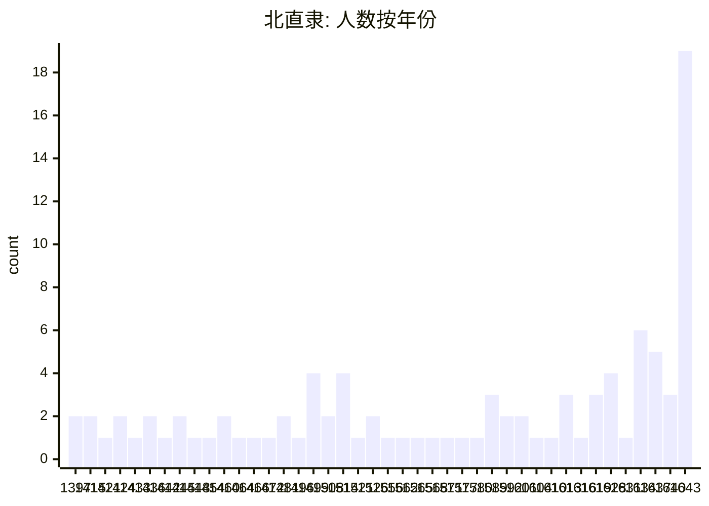
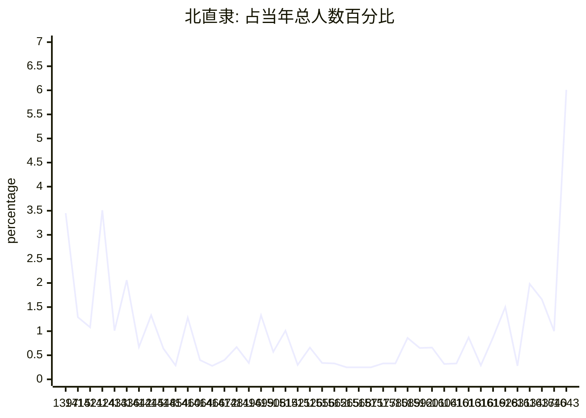

# Graph: 北直隶 Yearly Count

```mermaid
xychart-beta
    title "北直隶: 人数按年份"
    x-axis [1397, 1415, 1421, 1424, 1433, 1436, 1442, 1445, 1448, 1454, 1460, 1464, 1466, 1472, 1481, 1496, 1499, 1508, 1514, 1521, 1526, 1556, 1562, 1565, 1568, 1571, 1577, 1580, 1589, 1592, 1601, 1604, 1610, 1613, 1616, 1619, 1628, 1631, 1634, 1637, 1640, 1643]
    y-axis "count" 0 --> 19
    bar [2, 2, 1, 2, 1, 2, 1, 2, 1, 1, 2, 1, 1, 1, 2, 1, 4, 2, 4, 1, 2, 1, 1, 1, 1, 1, 1, 1, 3, 2, 2, 1, 1, 3, 1, 3, 4, 1, 6, 5, 3, 19]
```

```mermaid
xychart-beta
    title "北直隶: 占当年总人数百分比"
    x-axis [1397, 1415, 1421, 1424, 1433, 1436, 1442, 1445, 1448, 1454, 1460, 1464, 1466, 1472, 1481, 1496, 1499, 1508, 1514, 1521, 1526, 1556, 1562, 1565, 1568, 1571, 1577, 1580, 1589, 1592, 1601, 1604, 1610, 1613, 1616, 1619, 1628, 1631, 1634, 1637, 1640, 1643]
    y-axis "percentage" 0 --> 7
    line [3.45, 1.29, 1.08, 3.51, 1.01, 2.06, 0.67, 1.33, 0.64, 0.29, 1.28, 0.40, 0.28, 0.40, 0.67, 0.34, 1.33, 0.57, 1.01, 0.30, 0.66, 0.34, 0.33, 0.25, 0.25, 0.25, 0.33, 0.33, 0.86, 0.65, 0.66, 0.32, 0.33, 0.87, 0.29, 0.87, 1.50, 0.28, 1.98, 1.66, 1.00, 6.01]
```
