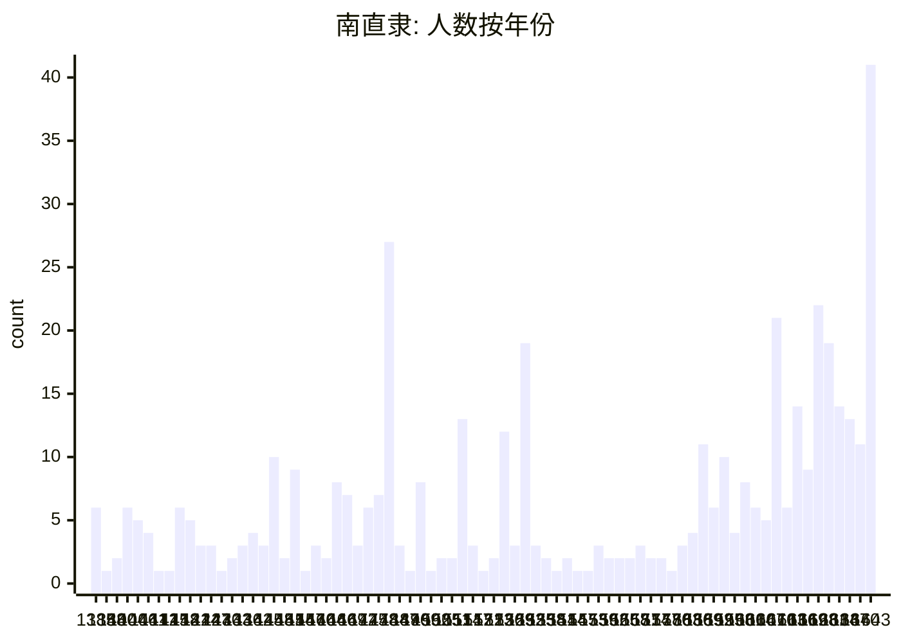
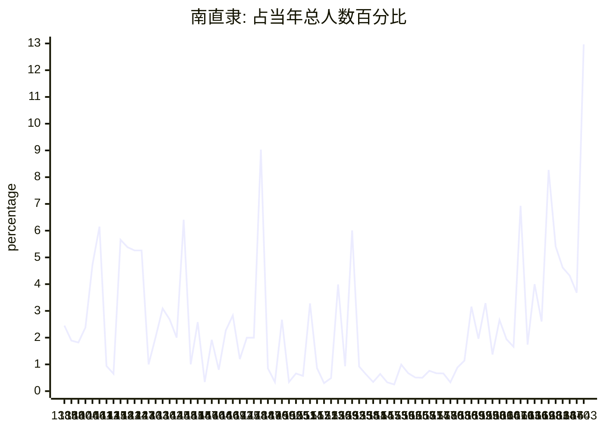

# Graph: 南直隶 Yearly Count

```mermaid
xychart-beta
    title "南直隶: 人数按年份"
    x-axis [1385, 1388, 1400, 1404, 1406, 1411, 1412, 1415, 1418, 1421, 1424, 1427, 1430, 1433, 1436, 1442, 1445, 1448, 1451, 1454, 1457, 1460, 1464, 1466, 1469, 1472, 1475, 1478, 1484, 1487, 1496, 1499, 1502, 1505, 1511, 1514, 1517, 1521, 1523, 1526, 1529, 1532, 1535, 1538, 1541, 1544, 1547, 1553, 1559, 1562, 1565, 1568, 1571, 1574, 1577, 1580, 1583, 1586, 1589, 1592, 1595, 1598, 1601, 1604, 1607, 1610, 1613, 1616, 1619, 1628, 1631, 1634, 1637, 1640, 1643]
    y-axis "count" 0 --> 41
    bar [6, 1, 2, 6, 5, 4, 1, 1, 6, 5, 3, 3, 1, 2, 3, 4, 3, 10, 2, 9, 1, 3, 2, 8, 7, 3, 6, 7, 27, 3, 1, 8, 1, 2, 2, 13, 3, 1, 2, 12, 3, 19, 3, 2, 1, 2, 1, 1, 3, 2, 2, 2, 3, 2, 2, 1, 3, 4, 11, 6, 10, 4, 8, 6, 5, 21, 6, 14, 9, 22, 19, 14, 13, 11, 41]
```

```mermaid
xychart-beta
    title "南直隶: 占当年总人数百分比"
    x-axis [1385, 1388, 1400, 1404, 1406, 1411, 1412, 1415, 1418, 1421, 1424, 1427, 1430, 1433, 1436, 1442, 1445, 1448, 1451, 1454, 1457, 1460, 1464, 1466, 1469, 1472, 1475, 1478, 1484, 1487, 1496, 1499, 1502, 1505, 1511, 1514, 1517, 1521, 1523, 1526, 1529, 1532, 1535, 1538, 1541, 1544, 1547, 1553, 1559, 1562, 1565, 1568, 1571, 1574, 1577, 1580, 1583, 1586, 1589, 1592, 1595, 1598, 1601, 1604, 1607, 1610, 1613, 1616, 1619, 1628, 1631, 1634, 1637, 1640, 1643]
    y-axis "percentage" 0 --> 13
    line [2.45, 1.89, 1.82, 2.38, 4.72, 6.15, 0.94, 0.65, 5.66, 5.38, 5.26, 5.26, 1.00, 2.02, 3.09, 2.68, 2.00, 6.41, 1.00, 2.58, 0.34, 1.92, 0.80, 2.27, 2.83, 1.20, 2.00, 2.00, 9.03, 0.85, 0.34, 2.67, 0.34, 0.66, 0.57, 3.28, 0.86, 0.30, 0.49, 3.99, 0.93, 6.01, 0.92, 0.62, 0.34, 0.64, 0.33, 0.25, 0.99, 0.67, 0.51, 0.50, 0.76, 0.67, 0.66, 0.33, 0.88, 1.14, 3.16, 1.96, 3.29, 1.37, 2.66, 1.94, 1.66, 6.93, 1.74, 4.00, 2.60, 8.27, 5.41, 4.62, 4.32, 3.68, 12.97]
```
