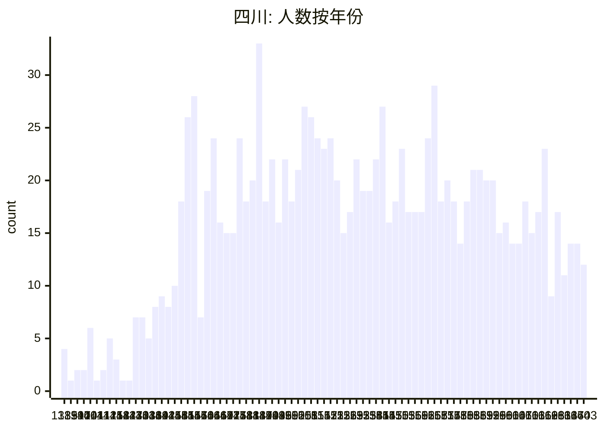

# Graph: 四川 Yearly Count

```mermaid
xychart-beta
    title "四川: 人数按年份"
    x-axis [1385, 1391, 1397, 1400, 1404, 1411, 1412, 1415, 1418, 1424, 1427, 1430, 1433, 1436, 1439, 1442, 1445, 1448, 1451, 1454, 1457, 1460, 1464, 1466, 1469, 1472, 1475, 1478, 1481, 1484, 1487, 1490, 1493, 1496, 1499, 1502, 1505, 1508, 1511, 1514, 1517, 1521, 1523, 1526, 1529, 1532, 1535, 1538, 1541, 1544, 1547, 1550, 1553, 1556, 1559, 1562, 1565, 1568, 1571, 1574, 1577, 1580, 1583, 1586, 1589, 1592, 1595, 1598, 1601, 1604, 1607, 1610, 1613, 1616, 1619, 1628, 1631, 1634, 1637, 1640, 1643]
    y-axis "count" 0 --> 33
    bar [4, 1, 2, 2, 6, 1, 2, 5, 3, 1, 1, 7, 7, 5, 8, 9, 8, 10, 18, 26, 28, 7, 19, 24, 16, 15, 15, 24, 18, 20, 33, 18, 22, 16, 22, 18, 21, 27, 26, 24, 23, 24, 20, 15, 17, 22, 19, 19, 22, 27, 16, 18, 23, 17, 17, 17, 24, 29, 18, 20, 18, 14, 18, 21, 21, 20, 20, 15, 16, 14, 14, 18, 15, 17, 23, 9, 17, 11, 14, 14, 12]
```
