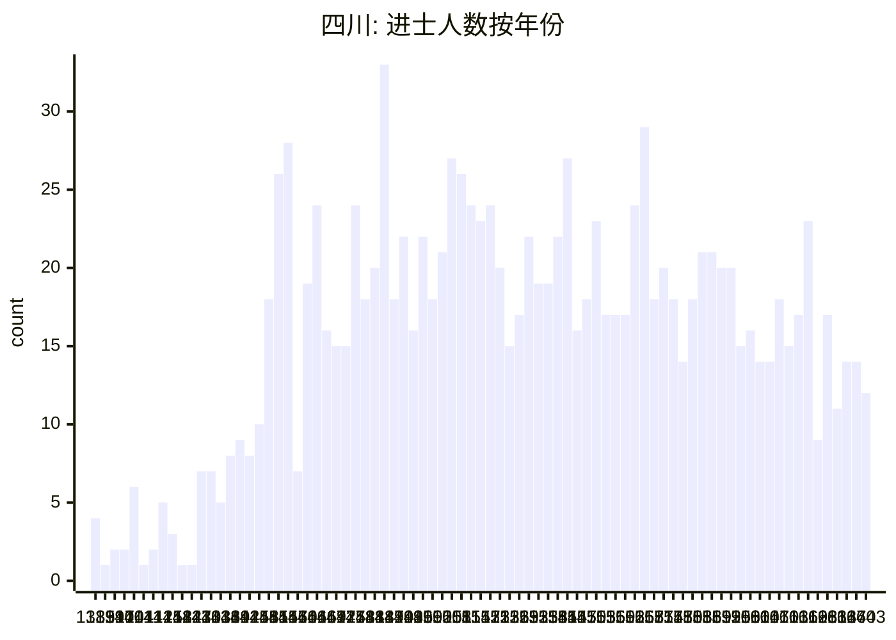
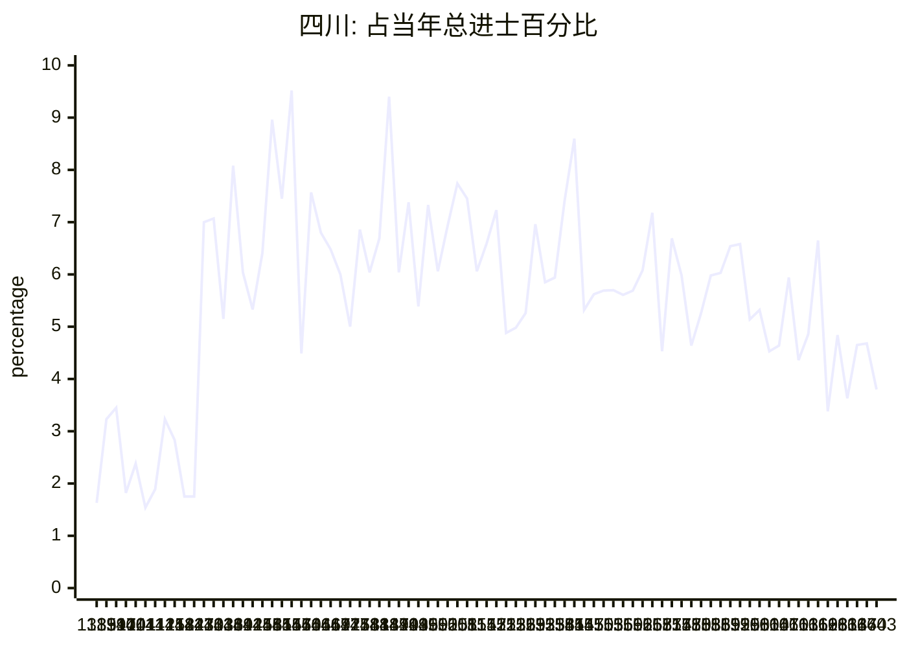

# Graph: 四川 Yearly Count

```mermaid
xychart-beta
    title "四川: 进士人数按年份"
    x-axis [1385, 1391, 1397, 1400, 1404, 1411, 1412, 1415, 1418, 1424, 1427, 1430, 1433, 1436, 1439, 1442, 1445, 1448, 1451, 1454, 1457, 1460, 1464, 1466, 1469, 1472, 1475, 1478, 1481, 1484, 1487, 1490, 1493, 1496, 1499, 1502, 1505, 1508, 1511, 1514, 1517, 1521, 1523, 1526, 1529, 1532, 1535, 1538, 1541, 1544, 1547, 1550, 1553, 1556, 1559, 1562, 1565, 1568, 1571, 1574, 1577, 1580, 1583, 1586, 1589, 1592, 1595, 1598, 1601, 1604, 1607, 1610, 1613, 1616, 1619, 1628, 1631, 1634, 1637, 1640, 1643]
    y-axis "count" 0 --> 33
    bar [4, 1, 2, 2, 6, 1, 2, 5, 3, 1, 1, 7, 7, 5, 8, 9, 8, 10, 18, 26, 28, 7, 19, 24, 16, 15, 15, 24, 18, 20, 33, 18, 22, 16, 22, 18, 21, 27, 26, 24, 23, 24, 20, 15, 17, 22, 19, 19, 22, 27, 16, 18, 23, 17, 17, 17, 24, 29, 18, 20, 18, 14, 18, 21, 21, 20, 20, 15, 16, 14, 14, 18, 15, 17, 23, 9, 17, 11, 14, 14, 12]
```

```mermaid
xychart-beta
    title "四川: 占当年总进士百分比"
    x-axis [1385, 1391, 1397, 1400, 1404, 1411, 1412, 1415, 1418, 1424, 1427, 1430, 1433, 1436, 1439, 1442, 1445, 1448, 1451, 1454, 1457, 1460, 1464, 1466, 1469, 1472, 1475, 1478, 1481, 1484, 1487, 1490, 1493, 1496, 1499, 1502, 1505, 1508, 1511, 1514, 1517, 1521, 1523, 1526, 1529, 1532, 1535, 1538, 1541, 1544, 1547, 1550, 1553, 1556, 1559, 1562, 1565, 1568, 1571, 1574, 1577, 1580, 1583, 1586, 1589, 1592, 1595, 1598, 1601, 1604, 1607, 1610, 1613, 1616, 1619, 1628, 1631, 1634, 1637, 1640, 1643]
    y-axis "percentage" 0 --> 10
    line [1.63, 3.23, 3.45, 1.82, 2.38, 1.54, 1.89, 3.23, 2.83, 1.75, 1.75, 7.00, 7.07, 5.15, 8.08, 6.04, 5.33, 6.41, 8.96, 7.45, 9.52, 4.49, 7.57, 6.80, 6.48, 6.00, 5.00, 6.86, 6.04, 6.69, 9.40, 6.04, 7.38, 5.39, 7.33, 6.06, 6.93, 7.74, 7.45, 6.06, 6.59, 7.23, 4.88, 4.98, 5.26, 6.96, 5.85, 5.94, 7.41, 8.60, 5.32, 5.62, 5.69, 5.70, 5.61, 5.69, 6.08, 7.18, 4.53, 6.69, 5.98, 4.64, 5.26, 5.98, 6.03, 6.54, 6.58, 5.14, 5.32, 4.53, 4.64, 5.94, 4.36, 4.86, 6.65, 3.38, 4.84, 3.63, 4.65, 4.68, 3.80]
```
