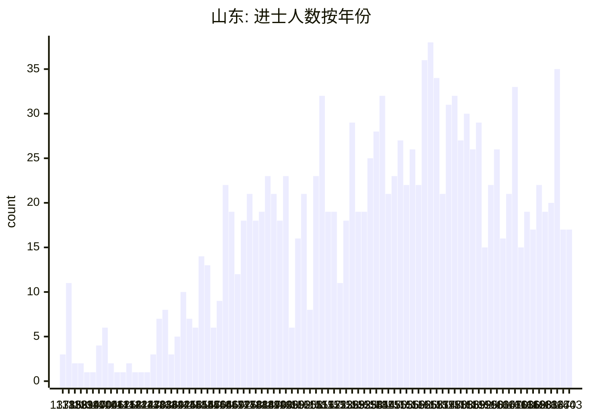
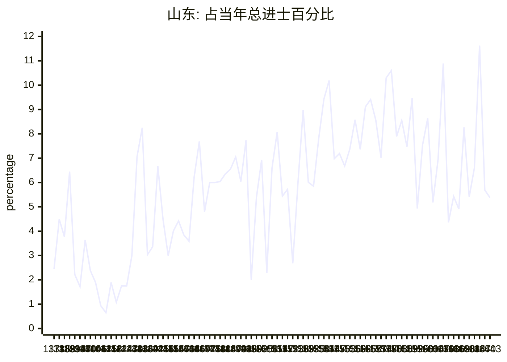

# Graph: 山东 Yearly Count

```mermaid
xychart-beta
    title "山东: 进士人数按年份"
    x-axis [1371, 1385, 1388, 1391, 1394, 1397, 1400, 1404, 1406, 1412, 1415, 1418, 1421, 1424, 1427, 1430, 1433, 1436, 1439, 1442, 1445, 1448, 1451, 1454, 1457, 1460, 1464, 1466, 1469, 1472, 1475, 1478, 1481, 1484, 1487, 1490, 1493, 1496, 1499, 1502, 1505, 1508, 1511, 1514, 1517, 1521, 1523, 1526, 1529, 1532, 1535, 1538, 1541, 1544, 1547, 1550, 1553, 1556, 1559, 1562, 1565, 1568, 1571, 1574, 1577, 1580, 1583, 1586, 1589, 1592, 1595, 1598, 1601, 1604, 1607, 1610, 1613, 1616, 1619, 1628, 1631, 1634, 1637, 1640, 1643]
    y-axis "count" 0 --> 38
    bar [3, 11, 2, 2, 1, 1, 4, 6, 2, 1, 1, 2, 1, 1, 1, 3, 7, 8, 3, 5, 10, 7, 6, 14, 13, 6, 9, 22, 19, 12, 18, 21, 18, 19, 23, 21, 18, 23, 6, 16, 21, 8, 23, 32, 19, 19, 11, 18, 29, 19, 19, 25, 28, 32, 21, 23, 27, 22, 26, 22, 36, 38, 34, 21, 31, 32, 27, 30, 26, 29, 15, 22, 26, 16, 21, 33, 15, 19, 17, 22, 19, 20, 35, 17, 17]
```

```mermaid
xychart-beta
    title "山东: 占当年总进士百分比"
    x-axis [1371, 1385, 1388, 1391, 1394, 1397, 1400, 1404, 1406, 1412, 1415, 1418, 1421, 1424, 1427, 1430, 1433, 1436, 1439, 1442, 1445, 1448, 1451, 1454, 1457, 1460, 1464, 1466, 1469, 1472, 1475, 1478, 1481, 1484, 1487, 1490, 1493, 1496, 1499, 1502, 1505, 1508, 1511, 1514, 1517, 1521, 1523, 1526, 1529, 1532, 1535, 1538, 1541, 1544, 1547, 1550, 1553, 1556, 1559, 1562, 1565, 1568, 1571, 1574, 1577, 1580, 1583, 1586, 1589, 1592, 1595, 1598, 1601, 1604, 1607, 1610, 1613, 1616, 1619, 1628, 1631, 1634, 1637, 1640, 1643]
    y-axis "percentage" 0 --> 12
    line [2.44, 4.49, 3.77, 6.45, 2.22, 1.72, 3.64, 2.38, 1.89, 0.94, 0.65, 1.89, 1.08, 1.75, 1.75, 3.00, 7.07, 8.25, 3.03, 3.36, 6.67, 4.49, 2.99, 4.01, 4.42, 3.85, 3.59, 6.23, 7.69, 4.80, 6.00, 6.00, 6.04, 6.35, 6.55, 7.05, 6.04, 7.74, 2.00, 5.39, 6.93, 2.29, 6.59, 8.08, 5.44, 5.72, 2.68, 5.98, 8.98, 6.01, 5.85, 7.81, 9.43, 10.19, 6.98, 7.19, 6.68, 7.38, 8.58, 7.36, 9.11, 9.41, 8.56, 7.02, 10.30, 10.60, 7.89, 8.55, 7.47, 9.48, 4.93, 7.53, 8.64, 5.18, 6.95, 10.89, 4.36, 5.43, 4.91, 8.27, 5.41, 6.60, 11.63, 5.69, 5.38]
```
