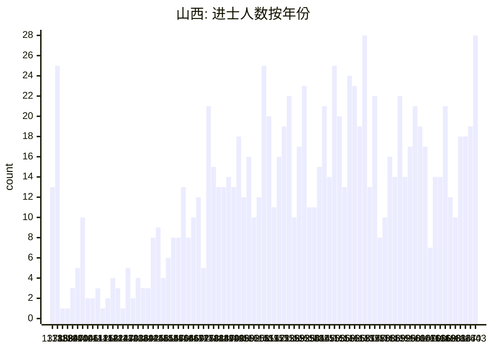
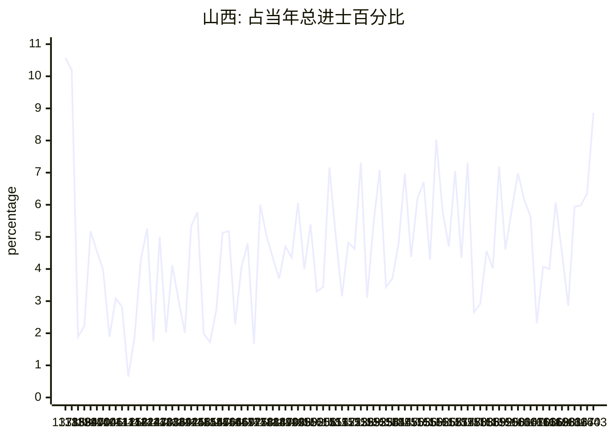

# Graph: 山西 Yearly Count

```mermaid
xychart-beta
    title "山西: 进士人数按年份"
    x-axis [1371, 1385, 1388, 1394, 1397, 1400, 1404, 1406, 1411, 1412, 1415, 1418, 1421, 1424, 1427, 1430, 1433, 1436, 1439, 1442, 1445, 1448, 1451, 1454, 1457, 1460, 1464, 1466, 1469, 1472, 1475, 1478, 1481, 1484, 1487, 1490, 1493, 1496, 1499, 1502, 1505, 1508, 1511, 1514, 1517, 1521, 1523, 1526, 1529, 1532, 1535, 1538, 1541, 1544, 1547, 1550, 1553, 1556, 1559, 1562, 1565, 1568, 1571, 1574, 1577, 1580, 1583, 1586, 1589, 1592, 1595, 1598, 1601, 1604, 1607, 1610, 1613, 1616, 1619, 1628, 1631, 1634, 1637, 1640, 1643]
    y-axis "count" 0 --> 28
    bar [13, 25, 1, 1, 3, 5, 10, 2, 2, 3, 1, 2, 4, 3, 1, 5, 2, 4, 3, 3, 8, 9, 4, 6, 8, 8, 13, 8, 10, 12, 5, 21, 15, 13, 13, 14, 13, 18, 12, 16, 10, 12, 25, 20, 11, 16, 19, 22, 10, 17, 23, 11, 11, 15, 21, 14, 25, 20, 13, 24, 23, 19, 28, 13, 22, 8, 10, 16, 14, 22, 14, 17, 21, 19, 17, 7, 14, 14, 21, 12, 10, 18, 18, 19, 28]
```

```mermaid
xychart-beta
    title "山西: 占当年总进士百分比"
    x-axis [1371, 1385, 1388, 1394, 1397, 1400, 1404, 1406, 1411, 1412, 1415, 1418, 1421, 1424, 1427, 1430, 1433, 1436, 1439, 1442, 1445, 1448, 1451, 1454, 1457, 1460, 1464, 1466, 1469, 1472, 1475, 1478, 1481, 1484, 1487, 1490, 1493, 1496, 1499, 1502, 1505, 1508, 1511, 1514, 1517, 1521, 1523, 1526, 1529, 1532, 1535, 1538, 1541, 1544, 1547, 1550, 1553, 1556, 1559, 1562, 1565, 1568, 1571, 1574, 1577, 1580, 1583, 1586, 1589, 1592, 1595, 1598, 1601, 1604, 1607, 1610, 1613, 1616, 1619, 1628, 1631, 1634, 1637, 1640, 1643]
    y-axis "percentage" 0 --> 11
    line [10.57, 10.20, 1.89, 2.22, 5.17, 4.55, 3.97, 1.89, 3.08, 2.83, 0.65, 1.89, 4.30, 5.26, 1.75, 5.00, 2.02, 4.12, 3.03, 2.01, 5.33, 5.77, 1.99, 1.72, 2.72, 5.13, 5.18, 2.27, 4.05, 4.80, 1.67, 6.00, 5.03, 4.35, 3.70, 4.70, 4.36, 6.06, 4.00, 5.39, 3.30, 3.44, 7.16, 5.05, 3.15, 4.82, 4.63, 7.31, 3.10, 5.38, 7.08, 3.44, 3.70, 4.78, 6.98, 4.38, 6.19, 6.71, 4.29, 8.03, 5.82, 4.70, 7.05, 4.35, 7.31, 2.65, 2.92, 4.56, 4.02, 7.19, 4.61, 5.82, 6.98, 6.15, 5.63, 2.31, 4.07, 4.00, 6.07, 4.51, 2.85, 5.94, 5.98, 6.35, 8.86]
```
