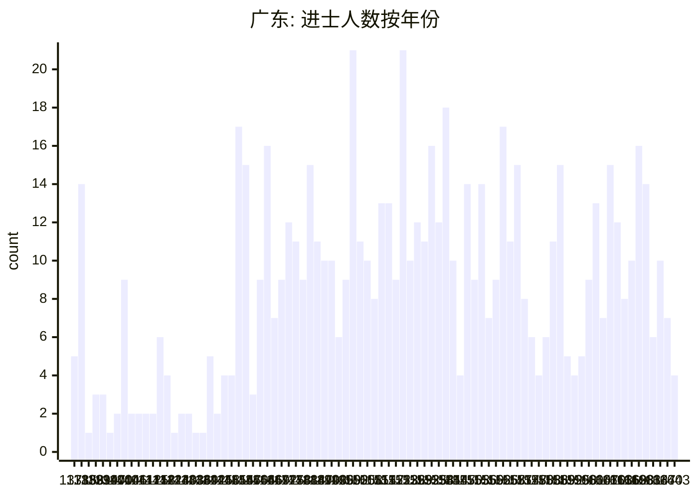
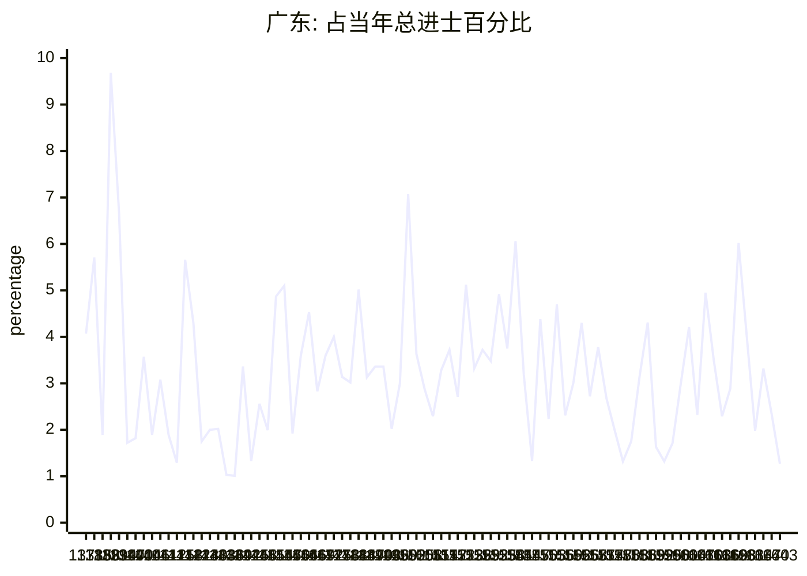

# Graph: 广东 Yearly Count

```mermaid
xychart-beta
    title "广东: 进士人数按年份"
    x-axis [1371, 1385, 1388, 1391, 1394, 1397, 1400, 1404, 1406, 1411, 1412, 1415, 1418, 1421, 1424, 1430, 1433, 1436, 1439, 1442, 1445, 1448, 1451, 1454, 1457, 1460, 1464, 1466, 1469, 1472, 1475, 1478, 1481, 1484, 1487, 1490, 1493, 1496, 1499, 1502, 1505, 1508, 1511, 1514, 1517, 1521, 1523, 1526, 1529, 1532, 1535, 1538, 1541, 1544, 1547, 1550, 1553, 1556, 1559, 1562, 1565, 1568, 1571, 1574, 1577, 1580, 1583, 1586, 1589, 1592, 1595, 1598, 1601, 1604, 1607, 1610, 1613, 1616, 1619, 1628, 1631, 1634, 1637, 1640, 1643]
    y-axis "count" 0 --> 21
    bar [5, 14, 1, 3, 3, 1, 2, 9, 2, 2, 2, 2, 6, 4, 1, 2, 2, 1, 1, 5, 2, 4, 4, 17, 15, 3, 9, 16, 7, 9, 12, 11, 9, 15, 11, 10, 10, 6, 9, 21, 11, 10, 8, 13, 13, 9, 21, 10, 12, 11, 16, 12, 18, 10, 4, 14, 9, 14, 7, 9, 17, 11, 15, 8, 6, 4, 6, 11, 15, 5, 4, 5, 9, 13, 7, 15, 12, 8, 10, 16, 14, 6, 10, 7, 4]
```

```mermaid
xychart-beta
    title "广东: 占当年总进士百分比"
    x-axis [1371, 1385, 1388, 1391, 1394, 1397, 1400, 1404, 1406, 1411, 1412, 1415, 1418, 1421, 1424, 1430, 1433, 1436, 1439, 1442, 1445, 1448, 1451, 1454, 1457, 1460, 1464, 1466, 1469, 1472, 1475, 1478, 1481, 1484, 1487, 1490, 1493, 1496, 1499, 1502, 1505, 1508, 1511, 1514, 1517, 1521, 1523, 1526, 1529, 1532, 1535, 1538, 1541, 1544, 1547, 1550, 1553, 1556, 1559, 1562, 1565, 1568, 1571, 1574, 1577, 1580, 1583, 1586, 1589, 1592, 1595, 1598, 1601, 1604, 1607, 1610, 1613, 1616, 1619, 1628, 1631, 1634, 1637, 1640, 1643]
    y-axis "percentage" 0 --> 10
    line [4.07, 5.71, 1.89, 9.68, 6.67, 1.72, 1.82, 3.57, 1.89, 3.08, 1.89, 1.29, 5.66, 4.30, 1.75, 2.00, 2.02, 1.03, 1.01, 3.36, 1.33, 2.56, 1.99, 4.87, 5.10, 1.92, 3.59, 4.53, 2.83, 3.60, 4.00, 3.14, 3.02, 5.02, 3.13, 3.36, 3.36, 2.02, 3.00, 7.07, 3.63, 2.87, 2.29, 3.28, 3.72, 2.71, 5.12, 3.32, 3.72, 3.48, 4.92, 3.75, 6.06, 3.18, 1.33, 4.38, 2.23, 4.70, 2.31, 3.01, 4.30, 2.72, 3.78, 2.68, 1.99, 1.32, 1.75, 3.13, 4.31, 1.63, 1.32, 1.71, 2.99, 4.21, 2.32, 4.95, 3.49, 2.29, 2.89, 6.02, 3.99, 1.98, 3.32, 2.34, 1.27]
```
