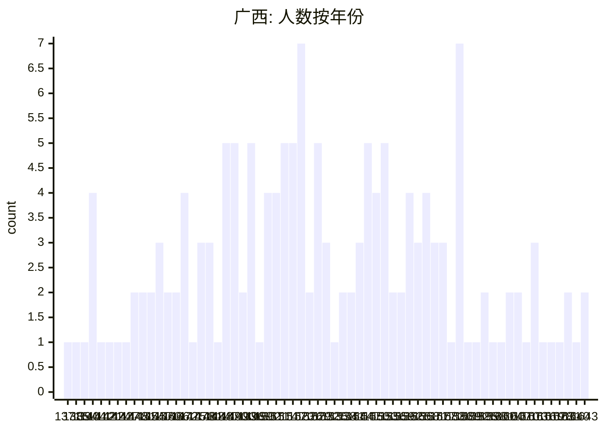

# Graph: 广西 Yearly Count

```mermaid
xychart-beta
    title "广西: 人数按年份"
    x-axis [1371, 1385, 1394, 1404, 1412, 1421, 1424, 1427, 1448, 1451, 1454, 1457, 1460, 1466, 1472, 1475, 1478, 1481, 1484, 1487, 1490, 1493, 1496, 1499, 1502, 1511, 1514, 1517, 1523, 1526, 1529, 1532, 1535, 1538, 1541, 1544, 1547, 1550, 1553, 1556, 1559, 1562, 1565, 1568, 1571, 1577, 1583, 1586, 1589, 1592, 1595, 1598, 1601, 1604, 1607, 1610, 1613, 1616, 1619, 1628, 1631, 1640, 1643]
    y-axis "count" 0 --> 7
    bar [1, 1, 1, 4, 1, 1, 1, 1, 2, 2, 2, 3, 2, 2, 4, 1, 3, 3, 1, 5, 5, 2, 5, 1, 4, 4, 5, 5, 7, 2, 5, 3, 1, 2, 2, 3, 5, 4, 5, 2, 2, 4, 3, 4, 3, 3, 1, 7, 1, 1, 2, 1, 1, 2, 2, 1, 3, 1, 1, 1, 2, 1, 2]
```
