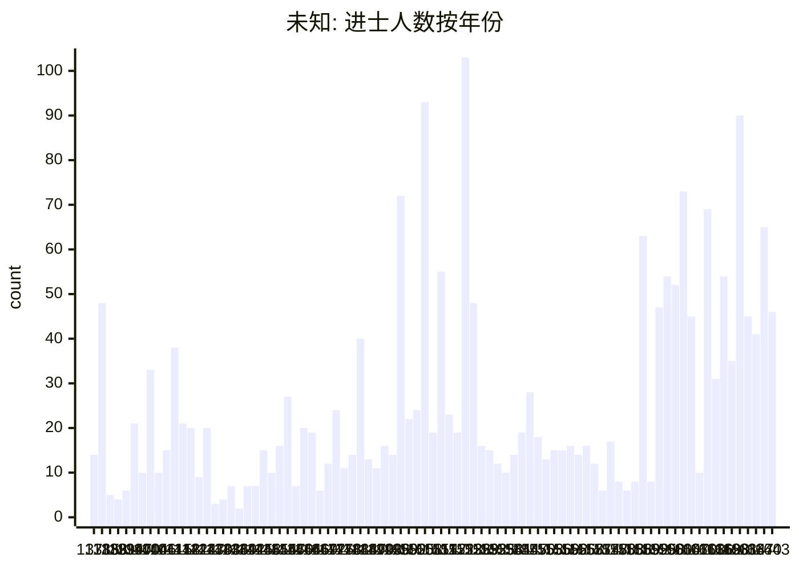
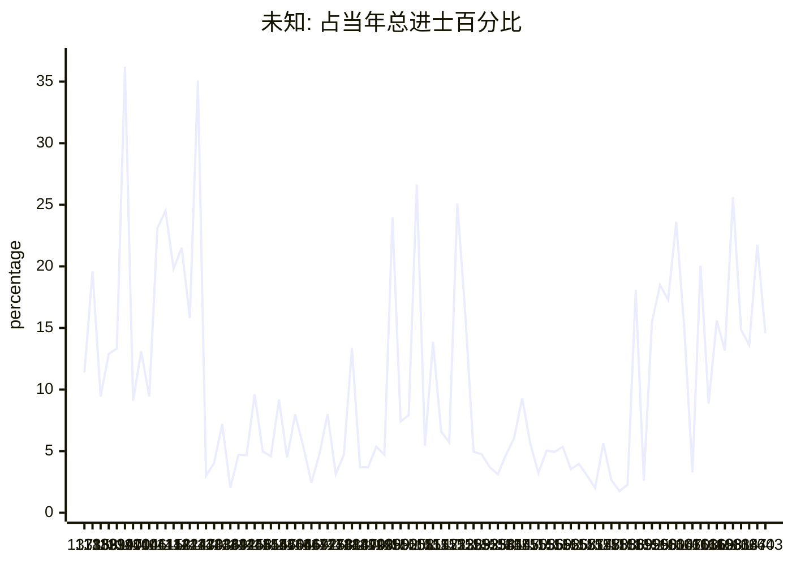

# Graph: 未知 Yearly Count

```mermaid
xychart-beta
    title "未知: 进士人数按年份"
    x-axis [1371, 1385, 1388, 1391, 1394, 1397, 1400, 1404, 1406, 1411, 1415, 1418, 1421, 1424, 1427, 1430, 1433, 1436, 1439, 1442, 1445, 1448, 1451, 1454, 1457, 1460, 1464, 1466, 1469, 1472, 1475, 1478, 1481, 1484, 1487, 1490, 1493, 1496, 1499, 1502, 1505, 1508, 1511, 1514, 1517, 1521, 1523, 1526, 1529, 1532, 1535, 1538, 1541, 1544, 1547, 1550, 1553, 1556, 1559, 1562, 1565, 1568, 1571, 1574, 1577, 1580, 1583, 1586, 1589, 1592, 1595, 1598, 1601, 1604, 1607, 1610, 1613, 1616, 1619, 1628, 1631, 1634, 1637, 1640, 1643]
    y-axis "count" 0 --> 103
    bar [14, 48, 5, 4, 6, 21, 10, 33, 10, 15, 38, 21, 20, 9, 20, 3, 4, 7, 2, 7, 7, 15, 10, 16, 27, 7, 20, 19, 6, 12, 24, 11, 14, 40, 13, 11, 16, 14, 72, 22, 24, 93, 19, 55, 23, 19, 103, 48, 16, 15, 12, 10, 14, 19, 28, 18, 13, 15, 15, 16, 14, 16, 12, 6, 17, 8, 6, 8, 63, 8, 47, 54, 52, 73, 45, 10, 69, 31, 54, 35, 90, 45, 41, 65, 46]
```

```mermaid
xychart-beta
    title "未知: 占当年总进士百分比"
    x-axis [1371, 1385, 1388, 1391, 1394, 1397, 1400, 1404, 1406, 1411, 1415, 1418, 1421, 1424, 1427, 1430, 1433, 1436, 1439, 1442, 1445, 1448, 1451, 1454, 1457, 1460, 1464, 1466, 1469, 1472, 1475, 1478, 1481, 1484, 1487, 1490, 1493, 1496, 1499, 1502, 1505, 1508, 1511, 1514, 1517, 1521, 1523, 1526, 1529, 1532, 1535, 1538, 1541, 1544, 1547, 1550, 1553, 1556, 1559, 1562, 1565, 1568, 1571, 1574, 1577, 1580, 1583, 1586, 1589, 1592, 1595, 1598, 1601, 1604, 1607, 1610, 1613, 1616, 1619, 1628, 1631, 1634, 1637, 1640, 1643]
    y-axis "percentage" 0 --> 37
    line [11.38, 19.59, 9.43, 12.90, 13.33, 36.21, 9.09, 13.10, 9.43, 23.08, 24.52, 19.81, 21.51, 15.79, 35.09, 3.00, 4.04, 7.22, 2.02, 4.70, 4.67, 9.62, 4.98, 4.58, 9.18, 4.49, 7.97, 5.38, 2.43, 4.80, 8.00, 3.14, 4.70, 13.38, 3.70, 3.69, 5.37, 4.71, 24.00, 7.41, 7.92, 26.65, 5.44, 13.89, 6.59, 5.72, 25.12, 15.95, 4.95, 4.75, 3.69, 3.12, 4.71, 6.05, 9.30, 5.62, 3.22, 5.03, 4.95, 5.35, 3.54, 3.96, 3.02, 2.01, 5.65, 2.65, 1.75, 2.28, 18.10, 2.61, 15.46, 18.49, 17.28, 23.62, 14.90, 3.30, 20.06, 8.86, 15.61, 13.16, 25.64, 14.85, 13.62, 21.74, 14.56]
```
