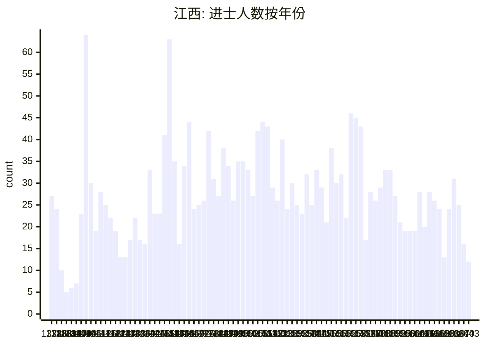
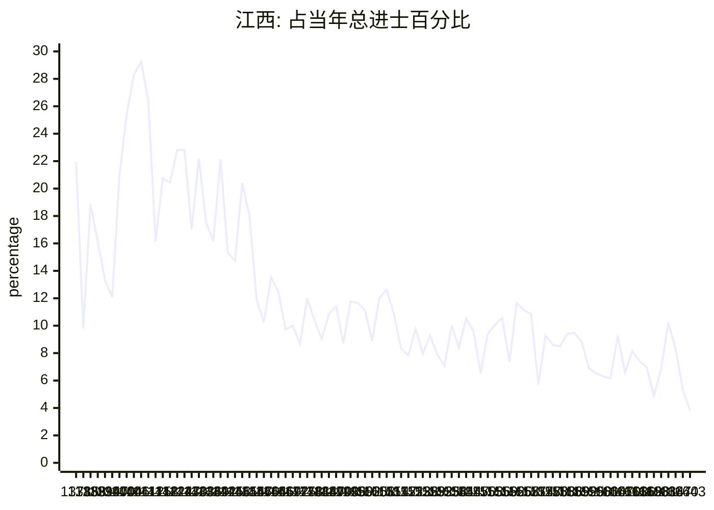

# Graph: 江西 Yearly Count

```mermaid
xychart-beta
    title "江西: 进士人数按年份"
    x-axis [1371, 1385, 1388, 1391, 1394, 1397, 1400, 1404, 1406, 1411, 1412, 1415, 1418, 1421, 1424, 1427, 1430, 1433, 1436, 1439, 1442, 1445, 1448, 1451, 1454, 1457, 1460, 1464, 1466, 1469, 1472, 1475, 1478, 1481, 1484, 1487, 1490, 1493, 1496, 1499, 1502, 1505, 1508, 1511, 1514, 1517, 1521, 1523, 1526, 1529, 1532, 1535, 1538, 1541, 1544, 1547, 1550, 1553, 1556, 1559, 1562, 1565, 1568, 1571, 1574, 1577, 1580, 1583, 1586, 1589, 1592, 1595, 1598, 1601, 1604, 1607, 1610, 1613, 1616, 1619, 1628, 1631, 1634, 1637, 1640, 1643]
    y-axis "count" 0 --> 64
    bar [27, 24, 10, 5, 6, 7, 23, 64, 30, 19, 28, 25, 22, 19, 13, 13, 17, 22, 17, 16, 33, 23, 23, 41, 63, 35, 16, 34, 44, 24, 25, 26, 42, 31, 27, 38, 34, 26, 35, 35, 33, 27, 42, 44, 43, 29, 26, 40, 24, 30, 25, 23, 32, 25, 33, 29, 21, 38, 30, 32, 22, 46, 45, 43, 17, 28, 26, 29, 33, 33, 27, 21, 19, 19, 19, 28, 20, 28, 26, 24, 13, 24, 31, 25, 16, 12]
```

```mermaid
xychart-beta
    title "江西: 占当年总进士百分比"
    x-axis [1371, 1385, 1388, 1391, 1394, 1397, 1400, 1404, 1406, 1411, 1412, 1415, 1418, 1421, 1424, 1427, 1430, 1433, 1436, 1439, 1442, 1445, 1448, 1451, 1454, 1457, 1460, 1464, 1466, 1469, 1472, 1475, 1478, 1481, 1484, 1487, 1490, 1493, 1496, 1499, 1502, 1505, 1508, 1511, 1514, 1517, 1521, 1523, 1526, 1529, 1532, 1535, 1538, 1541, 1544, 1547, 1550, 1553, 1556, 1559, 1562, 1565, 1568, 1571, 1574, 1577, 1580, 1583, 1586, 1589, 1592, 1595, 1598, 1601, 1604, 1607, 1610, 1613, 1616, 1619, 1628, 1631, 1634, 1637, 1640, 1643]
    y-axis "percentage" 0 --> 30
    line [21.95, 9.80, 18.87, 16.13, 13.33, 12.07, 20.91, 25.40, 28.30, 29.23, 26.42, 16.13, 20.75, 20.43, 22.81, 22.81, 17.00, 22.22, 17.53, 16.16, 22.15, 15.33, 14.74, 20.40, 18.05, 11.90, 10.26, 13.55, 12.46, 9.72, 10.00, 8.67, 12.00, 10.40, 9.03, 10.83, 11.41, 8.72, 11.78, 11.67, 11.11, 8.91, 12.03, 12.61, 10.86, 8.31, 7.83, 9.76, 7.97, 9.29, 7.91, 7.08, 10.00, 8.42, 10.51, 9.63, 6.56, 9.41, 10.07, 10.56, 7.36, 11.65, 11.14, 10.83, 5.69, 9.30, 8.61, 8.48, 9.40, 9.48, 8.82, 6.91, 6.51, 6.31, 6.15, 9.27, 6.60, 8.14, 7.43, 6.94, 4.89, 6.84, 10.23, 8.31, 5.35, 3.80]
```
