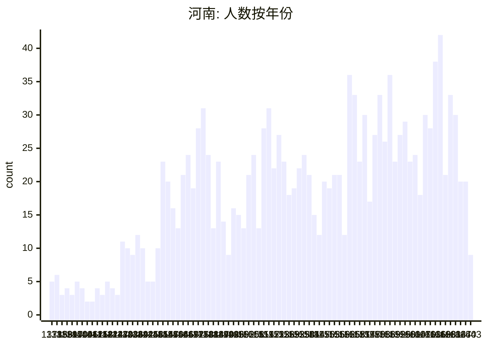

# Graph: 河南 Yearly Count

```mermaid
xychart-beta
    title "河南: 人数按年份"
    x-axis [1371, 1385, 1388, 1391, 1397, 1400, 1404, 1406, 1412, 1415, 1418, 1421, 1424, 1427, 1430, 1433, 1436, 1439, 1442, 1445, 1448, 1451, 1454, 1457, 1460, 1464, 1466, 1469, 1472, 1475, 1478, 1481, 1484, 1487, 1490, 1493, 1496, 1499, 1502, 1505, 1508, 1511, 1514, 1517, 1521, 1523, 1526, 1529, 1532, 1535, 1538, 1541, 1544, 1547, 1550, 1553, 1556, 1559, 1562, 1565, 1568, 1571, 1574, 1577, 1580, 1583, 1586, 1589, 1592, 1595, 1598, 1601, 1604, 1607, 1610, 1613, 1616, 1619, 1628, 1631, 1634, 1637, 1640, 1643]
    y-axis "count" 0 --> 42
    bar [5, 6, 3, 4, 3, 5, 4, 2, 2, 4, 3, 5, 4, 3, 11, 10, 9, 12, 10, 5, 5, 10, 23, 20, 16, 13, 21, 24, 19, 28, 31, 24, 13, 23, 14, 9, 16, 15, 13, 21, 24, 13, 28, 31, 22, 27, 23, 18, 19, 22, 24, 21, 15, 12, 20, 19, 21, 21, 12, 36, 33, 23, 30, 17, 27, 33, 26, 36, 23, 27, 29, 23, 24, 18, 30, 28, 38, 42, 21, 33, 30, 20, 20, 9]
```
