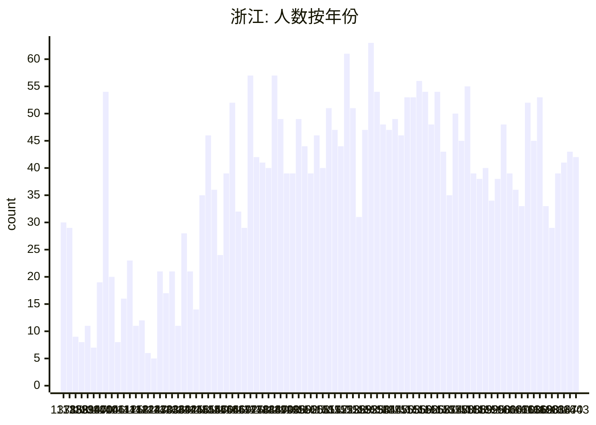
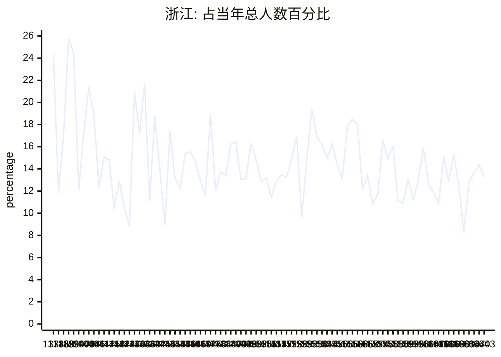

# Graph: 浙江 Yearly Count

```mermaid
xychart-beta
    title "浙江: 人数按年份"
    x-axis [1371, 1385, 1388, 1391, 1394, 1397, 1400, 1404, 1406, 1411, 1412, 1415, 1418, 1421, 1424, 1427, 1430, 1433, 1436, 1439, 1442, 1445, 1448, 1451, 1454, 1457, 1460, 1464, 1466, 1469, 1472, 1475, 1478, 1481, 1484, 1487, 1490, 1493, 1496, 1499, 1502, 1505, 1508, 1511, 1514, 1517, 1521, 1523, 1526, 1529, 1532, 1535, 1538, 1541, 1544, 1547, 1550, 1553, 1556, 1559, 1562, 1565, 1568, 1571, 1574, 1577, 1580, 1583, 1586, 1589, 1592, 1595, 1598, 1601, 1604, 1607, 1610, 1613, 1616, 1619, 1628, 1631, 1634, 1637, 1640, 1643]
    y-axis "count" 0 --> 63
    bar [30, 29, 9, 8, 11, 7, 19, 54, 20, 8, 16, 23, 11, 12, 6, 5, 21, 17, 21, 11, 28, 21, 14, 35, 46, 36, 24, 39, 52, 32, 29, 57, 42, 41, 40, 57, 49, 39, 39, 49, 44, 39, 46, 40, 51, 47, 44, 61, 51, 31, 47, 63, 54, 48, 47, 49, 46, 53, 53, 56, 54, 48, 54, 43, 35, 50, 45, 55, 39, 38, 40, 34, 38, 48, 39, 36, 33, 52, 45, 53, 33, 29, 39, 41, 43, 42]
```

```mermaid
xychart-beta
    title "浙江: 占当年总人数百分比"
    x-axis [1371, 1385, 1388, 1391, 1394, 1397, 1400, 1404, 1406, 1411, 1412, 1415, 1418, 1421, 1424, 1427, 1430, 1433, 1436, 1439, 1442, 1445, 1448, 1451, 1454, 1457, 1460, 1464, 1466, 1469, 1472, 1475, 1478, 1481, 1484, 1487, 1490, 1493, 1496, 1499, 1502, 1505, 1508, 1511, 1514, 1517, 1521, 1523, 1526, 1529, 1532, 1535, 1538, 1541, 1544, 1547, 1550, 1553, 1556, 1559, 1562, 1565, 1568, 1571, 1574, 1577, 1580, 1583, 1586, 1589, 1592, 1595, 1598, 1601, 1604, 1607, 1610, 1613, 1616, 1619, 1628, 1631, 1634, 1637, 1640, 1643]
    y-axis "percentage" 0 --> 26
    line [24.39, 11.84, 16.98, 25.81, 24.44, 12.07, 17.27, 21.43, 18.87, 12.31, 15.09, 14.84, 10.38, 12.90, 10.53, 8.77, 21.00, 17.17, 21.65, 11.11, 18.79, 14.00, 8.97, 17.41, 13.18, 12.24, 15.38, 15.54, 14.73, 12.96, 11.60, 19.00, 12.00, 13.76, 13.38, 16.24, 16.44, 13.09, 13.13, 16.33, 14.81, 12.87, 13.18, 11.46, 12.88, 13.47, 13.25, 14.88, 16.94, 9.60, 14.87, 19.38, 16.88, 16.16, 14.97, 16.28, 14.37, 13.12, 17.79, 18.48, 18.06, 12.15, 13.37, 10.83, 11.71, 16.61, 14.90, 16.08, 11.11, 10.92, 13.07, 11.18, 13.01, 15.95, 12.62, 11.92, 10.89, 15.12, 12.86, 15.32, 12.41, 8.26, 12.87, 13.62, 14.38, 13.29]
```
