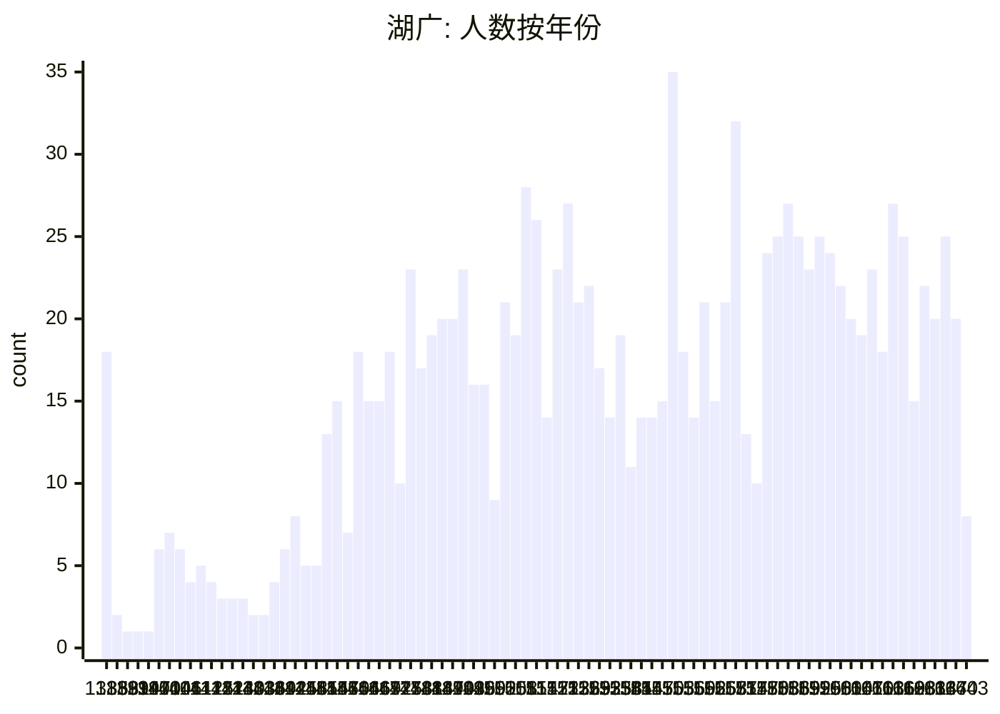

# Graph: 湖广 Yearly Count

```mermaid
xychart-beta
    title "湖广: 人数按年份"
    x-axis [1385, 1388, 1391, 1394, 1397, 1400, 1404, 1406, 1411, 1412, 1415, 1421, 1424, 1430, 1433, 1436, 1439, 1442, 1445, 1448, 1451, 1454, 1457, 1460, 1464, 1466, 1469, 1472, 1475, 1478, 1481, 1484, 1487, 1490, 1493, 1496, 1499, 1502, 1505, 1508, 1511, 1514, 1517, 1521, 1523, 1526, 1529, 1532, 1535, 1538, 1541, 1544, 1547, 1550, 1553, 1556, 1559, 1562, 1565, 1568, 1571, 1574, 1577, 1580, 1583, 1586, 1589, 1592, 1595, 1598, 1601, 1604, 1607, 1610, 1613, 1616, 1619, 1628, 1631, 1634, 1637, 1640, 1643]
    y-axis "count" 0 --> 35
    bar [18, 2, 1, 1, 1, 6, 7, 6, 4, 5, 4, 3, 3, 3, 2, 2, 4, 6, 8, 5, 5, 13, 15, 7, 18, 15, 15, 18, 10, 23, 17, 19, 20, 20, 23, 16, 16, 9, 21, 19, 28, 26, 14, 23, 27, 21, 22, 17, 14, 19, 11, 14, 14, 15, 35, 18, 14, 21, 15, 21, 32, 13, 10, 24, 25, 27, 25, 23, 25, 24, 22, 20, 19, 23, 18, 27, 25, 15, 22, 20, 25, 20, 8]
```
