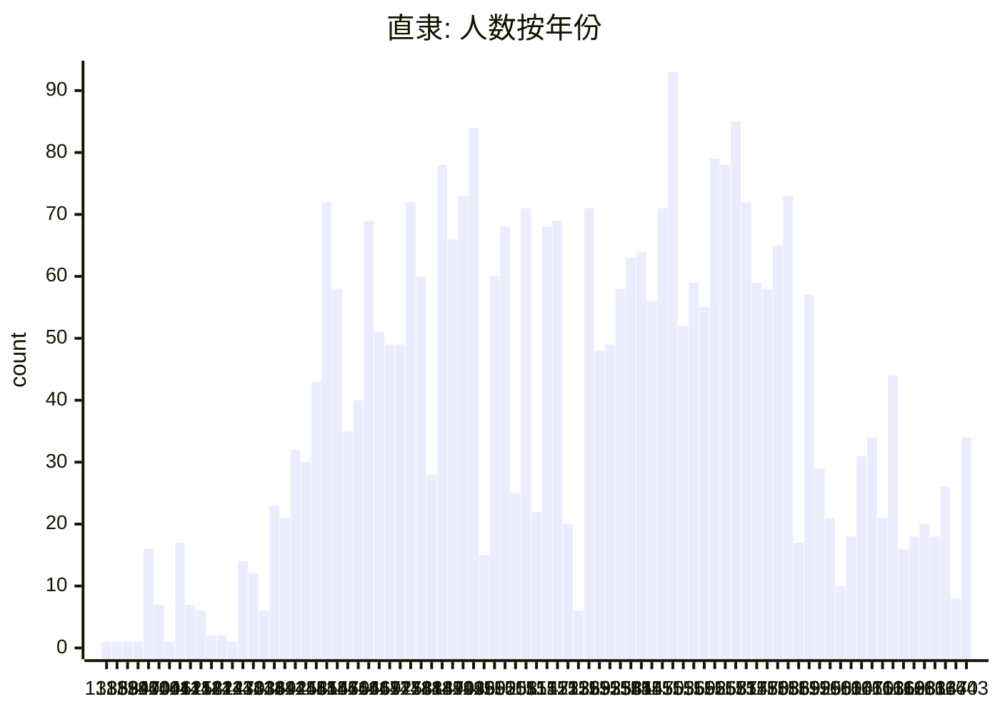

# Graph: 直隶 Yearly Count

```mermaid
xychart-beta
    title "直隶: 人数按年份"
    x-axis [1385, 1388, 1394, 1397, 1400, 1404, 1406, 1412, 1415, 1418, 1421, 1424, 1427, 1430, 1433, 1436, 1439, 1442, 1445, 1448, 1451, 1454, 1457, 1460, 1464, 1466, 1469, 1472, 1475, 1478, 1481, 1484, 1487, 1490, 1493, 1496, 1499, 1502, 1505, 1508, 1511, 1514, 1517, 1521, 1523, 1526, 1529, 1532, 1535, 1538, 1541, 1544, 1547, 1550, 1553, 1556, 1559, 1562, 1565, 1568, 1571, 1574, 1577, 1580, 1583, 1586, 1589, 1592, 1595, 1598, 1601, 1604, 1607, 1610, 1613, 1616, 1619, 1628, 1631, 1634, 1637, 1640, 1643]
    y-axis "count" 0 --> 93
    bar [1, 1, 1, 1, 16, 7, 1, 17, 7, 6, 2, 2, 1, 14, 12, 6, 23, 21, 32, 30, 43, 72, 58, 35, 40, 69, 51, 49, 49, 72, 60, 28, 78, 66, 73, 84, 15, 60, 68, 25, 71, 22, 68, 69, 20, 6, 71, 48, 49, 58, 63, 64, 56, 71, 93, 52, 59, 55, 79, 78, 85, 72, 59, 58, 65, 73, 17, 57, 29, 21, 10, 18, 31, 34, 21, 44, 16, 18, 20, 18, 26, 8, 34]
```
