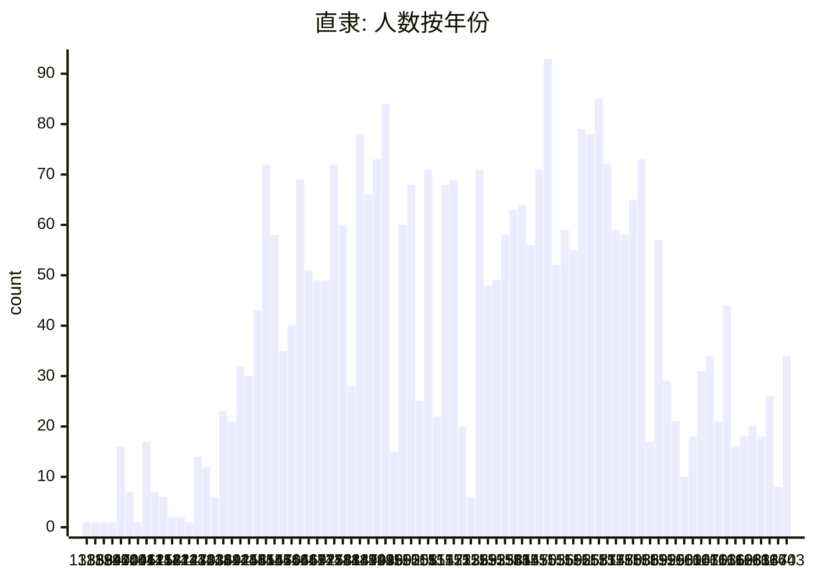
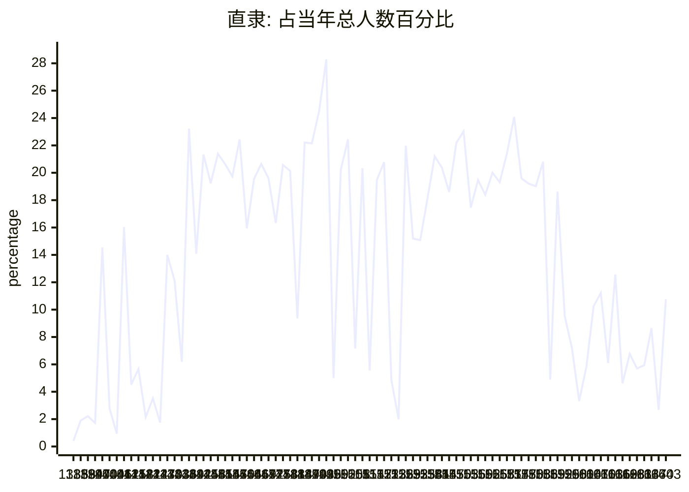

# Graph: 直隶 Yearly Count

```mermaid
xychart-beta
    title "直隶: 人数按年份"
    x-axis [1385, 1388, 1394, 1397, 1400, 1404, 1406, 1412, 1415, 1418, 1421, 1424, 1427, 1430, 1433, 1436, 1439, 1442, 1445, 1448, 1451, 1454, 1457, 1460, 1464, 1466, 1469, 1472, 1475, 1478, 1481, 1484, 1487, 1490, 1493, 1496, 1499, 1502, 1505, 1508, 1511, 1514, 1517, 1521, 1523, 1526, 1529, 1532, 1535, 1538, 1541, 1544, 1547, 1550, 1553, 1556, 1559, 1562, 1565, 1568, 1571, 1574, 1577, 1580, 1583, 1586, 1589, 1592, 1595, 1598, 1601, 1604, 1607, 1610, 1613, 1616, 1619, 1628, 1631, 1634, 1637, 1640, 1643]
    y-axis "count" 0 --> 93
    bar [1, 1, 1, 1, 16, 7, 1, 17, 7, 6, 2, 2, 1, 14, 12, 6, 23, 21, 32, 30, 43, 72, 58, 35, 40, 69, 51, 49, 49, 72, 60, 28, 78, 66, 73, 84, 15, 60, 68, 25, 71, 22, 68, 69, 20, 6, 71, 48, 49, 58, 63, 64, 56, 71, 93, 52, 59, 55, 79, 78, 85, 72, 59, 58, 65, 73, 17, 57, 29, 21, 10, 18, 31, 34, 21, 44, 16, 18, 20, 18, 26, 8, 34]
```

```mermaid
xychart-beta
    title "直隶: 占当年总人数百分比"
    x-axis [1385, 1388, 1394, 1397, 1400, 1404, 1406, 1412, 1415, 1418, 1421, 1424, 1427, 1430, 1433, 1436, 1439, 1442, 1445, 1448, 1451, 1454, 1457, 1460, 1464, 1466, 1469, 1472, 1475, 1478, 1481, 1484, 1487, 1490, 1493, 1496, 1499, 1502, 1505, 1508, 1511, 1514, 1517, 1521, 1523, 1526, 1529, 1532, 1535, 1538, 1541, 1544, 1547, 1550, 1553, 1556, 1559, 1562, 1565, 1568, 1571, 1574, 1577, 1580, 1583, 1586, 1589, 1592, 1595, 1598, 1601, 1604, 1607, 1610, 1613, 1616, 1619, 1628, 1631, 1634, 1637, 1640, 1643]
    y-axis "percentage" 0 --> 29
    line [0.41, 1.89, 2.22, 1.72, 14.55, 2.78, 0.94, 16.04, 4.52, 5.66, 2.15, 3.51, 1.75, 14.00, 12.12, 6.19, 23.23, 14.09, 21.33, 19.23, 21.39, 20.63, 19.73, 22.44, 15.94, 19.55, 20.65, 19.60, 16.33, 20.57, 20.13, 9.36, 22.22, 22.15, 24.50, 28.28, 5.00, 20.20, 22.44, 7.16, 20.34, 5.56, 19.48, 20.78, 4.88, 1.99, 21.98, 15.19, 15.08, 18.12, 21.21, 20.38, 18.60, 22.19, 23.02, 17.45, 19.47, 18.39, 20.00, 19.31, 21.41, 24.08, 19.60, 19.21, 19.01, 20.80, 4.89, 18.63, 9.54, 7.19, 3.32, 5.83, 10.26, 11.22, 6.10, 12.57, 4.62, 6.77, 5.70, 5.94, 8.64, 2.68, 10.76]
```
