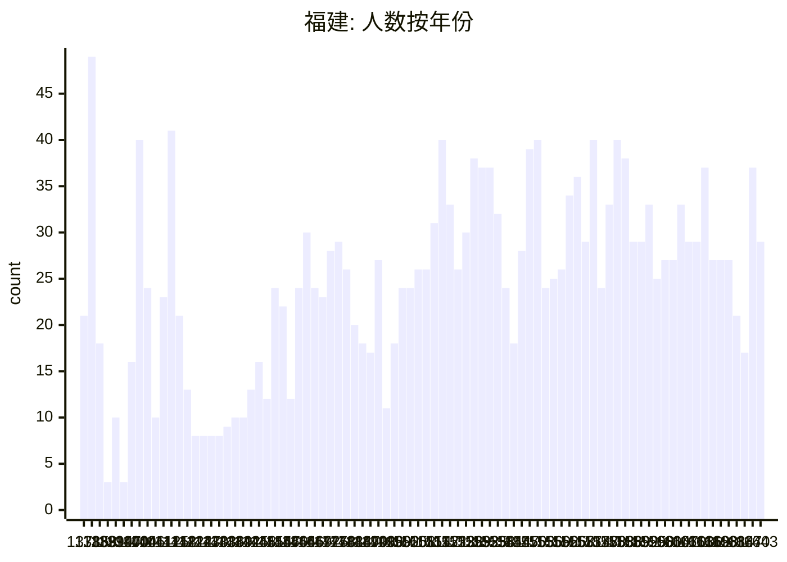

# Graph: 福建 Yearly Count

```mermaid
xychart-beta
    title "福建: 人数按年份"
    x-axis [1371, 1385, 1388, 1391, 1394, 1397, 1400, 1404, 1406, 1411, 1412, 1415, 1418, 1421, 1424, 1427, 1430, 1433, 1436, 1439, 1442, 1445, 1448, 1451, 1454, 1457, 1460, 1464, 1466, 1469, 1472, 1475, 1478, 1481, 1484, 1487, 1490, 1493, 1496, 1499, 1502, 1505, 1508, 1511, 1514, 1517, 1521, 1523, 1526, 1529, 1532, 1535, 1538, 1541, 1544, 1547, 1550, 1553, 1556, 1559, 1562, 1565, 1568, 1571, 1574, 1577, 1580, 1583, 1586, 1589, 1592, 1595, 1598, 1601, 1604, 1607, 1610, 1613, 1616, 1619, 1628, 1631, 1634, 1637, 1640, 1643]
    y-axis "count" 0 --> 49
    bar [21, 49, 18, 3, 10, 3, 16, 40, 24, 10, 23, 41, 21, 13, 8, 8, 8, 8, 9, 10, 10, 13, 16, 12, 24, 22, 12, 24, 30, 24, 23, 28, 29, 26, 20, 18, 17, 27, 11, 18, 24, 24, 26, 26, 31, 40, 33, 26, 30, 38, 37, 37, 32, 24, 18, 28, 39, 40, 24, 25, 26, 34, 36, 29, 40, 24, 33, 40, 38, 29, 29, 33, 25, 27, 27, 33, 29, 29, 37, 27, 27, 27, 21, 17, 37, 29]
```
