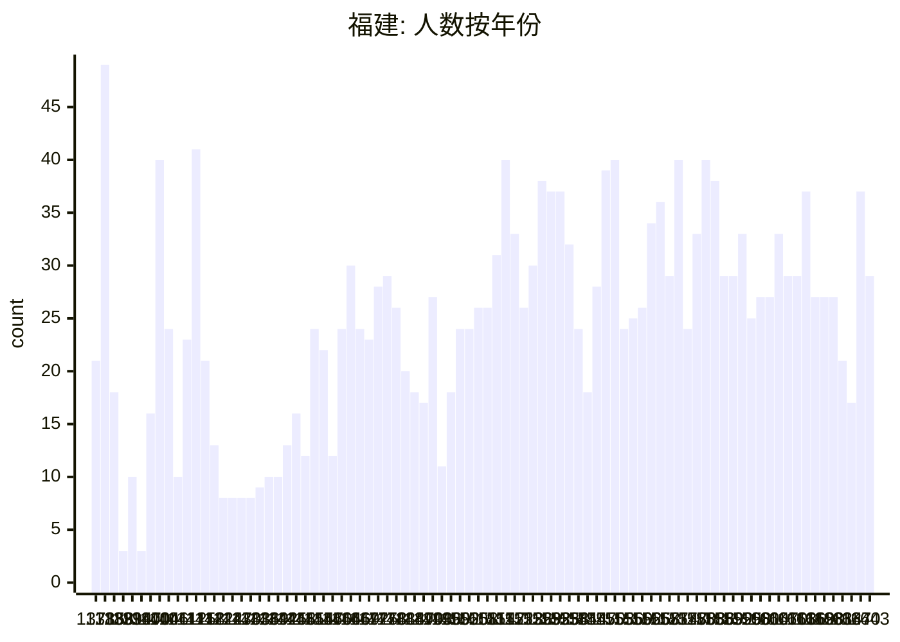
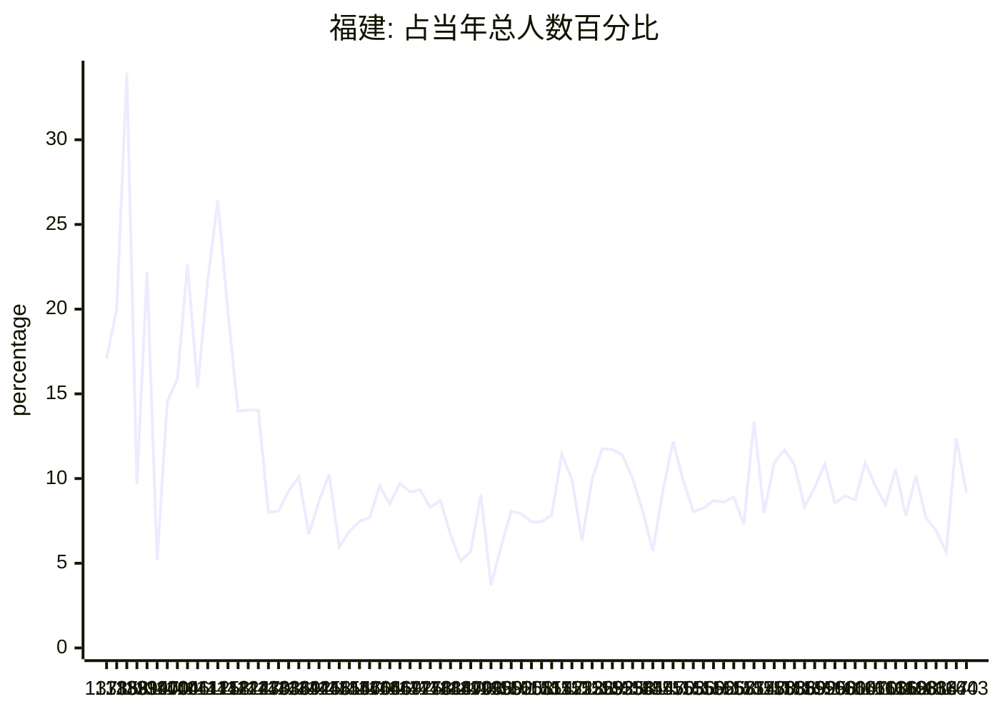

# Graph: 福建 Yearly Count

```mermaid
xychart-beta
    title "福建: 人数按年份"
    x-axis [1371, 1385, 1388, 1391, 1394, 1397, 1400, 1404, 1406, 1411, 1412, 1415, 1418, 1421, 1424, 1427, 1430, 1433, 1436, 1439, 1442, 1445, 1448, 1451, 1454, 1457, 1460, 1464, 1466, 1469, 1472, 1475, 1478, 1481, 1484, 1487, 1490, 1493, 1496, 1499, 1502, 1505, 1508, 1511, 1514, 1517, 1521, 1523, 1526, 1529, 1532, 1535, 1538, 1541, 1544, 1547, 1550, 1553, 1556, 1559, 1562, 1565, 1568, 1571, 1574, 1577, 1580, 1583, 1586, 1589, 1592, 1595, 1598, 1601, 1604, 1607, 1610, 1613, 1616, 1619, 1628, 1631, 1634, 1637, 1640, 1643]
    y-axis "count" 0 --> 49
    bar [21, 49, 18, 3, 10, 3, 16, 40, 24, 10, 23, 41, 21, 13, 8, 8, 8, 8, 9, 10, 10, 13, 16, 12, 24, 22, 12, 24, 30, 24, 23, 28, 29, 26, 20, 18, 17, 27, 11, 18, 24, 24, 26, 26, 31, 40, 33, 26, 30, 38, 37, 37, 32, 24, 18, 28, 39, 40, 24, 25, 26, 34, 36, 29, 40, 24, 33, 40, 38, 29, 29, 33, 25, 27, 27, 33, 29, 29, 37, 27, 27, 27, 21, 17, 37, 29]
```

```mermaid
xychart-beta
    title "福建: 占当年总人数百分比"
    x-axis [1371, 1385, 1388, 1391, 1394, 1397, 1400, 1404, 1406, 1411, 1412, 1415, 1418, 1421, 1424, 1427, 1430, 1433, 1436, 1439, 1442, 1445, 1448, 1451, 1454, 1457, 1460, 1464, 1466, 1469, 1472, 1475, 1478, 1481, 1484, 1487, 1490, 1493, 1496, 1499, 1502, 1505, 1508, 1511, 1514, 1517, 1521, 1523, 1526, 1529, 1532, 1535, 1538, 1541, 1544, 1547, 1550, 1553, 1556, 1559, 1562, 1565, 1568, 1571, 1574, 1577, 1580, 1583, 1586, 1589, 1592, 1595, 1598, 1601, 1604, 1607, 1610, 1613, 1616, 1619, 1628, 1631, 1634, 1637, 1640, 1643]
    y-axis "percentage" 0 --> 34
    line [17.07, 20.00, 33.96, 9.68, 22.22, 5.17, 14.55, 15.87, 22.64, 15.38, 21.70, 26.45, 19.81, 13.98, 14.04, 14.04, 8.00, 8.08, 9.28, 10.10, 6.71, 8.67, 10.26, 5.97, 6.88, 7.48, 7.69, 9.56, 8.50, 9.72, 9.20, 9.33, 8.29, 8.72, 6.69, 5.13, 5.70, 9.06, 3.70, 6.00, 8.08, 7.92, 7.45, 7.45, 7.83, 11.46, 9.94, 6.34, 9.97, 11.76, 11.71, 11.38, 10.00, 8.08, 5.73, 9.30, 12.19, 9.90, 8.05, 8.25, 8.70, 8.61, 8.91, 7.30, 13.38, 7.97, 10.93, 11.70, 10.83, 8.33, 9.48, 10.86, 8.56, 8.97, 8.74, 10.93, 9.57, 8.43, 10.57, 7.80, 10.15, 7.69, 6.93, 5.65, 12.37, 9.18]
```
