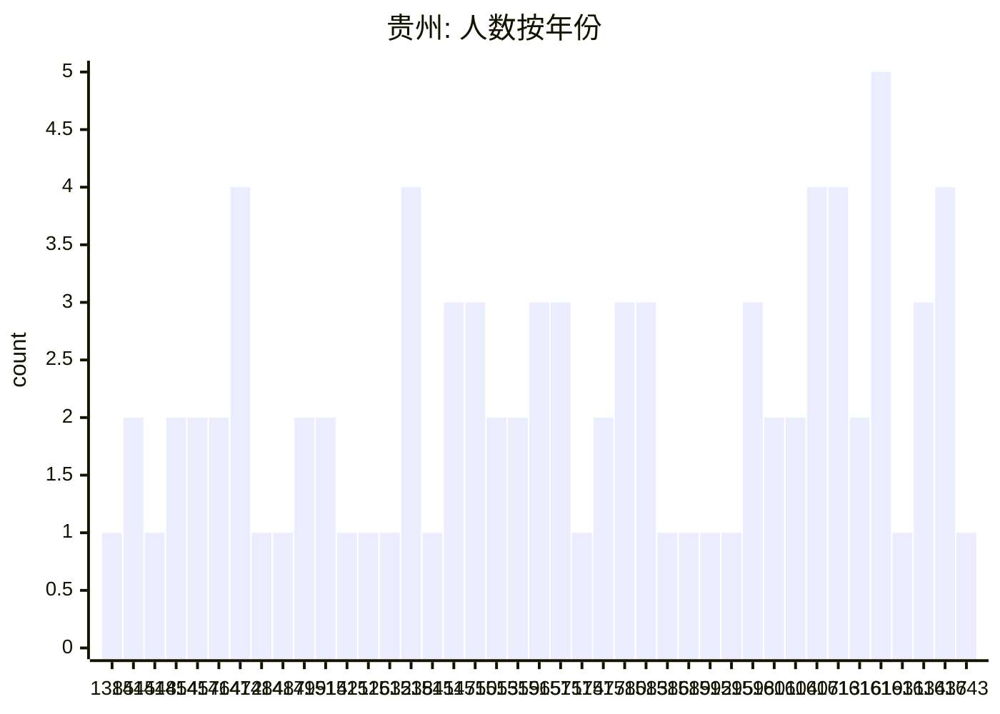

# Graph: 贵州 Yearly Count

```mermaid
xychart-beta
    title "贵州: 人数按年份"
    x-axis [1385, 1445, 1448, 1454, 1457, 1464, 1472, 1484, 1487, 1499, 1514, 1521, 1526, 1532, 1538, 1541, 1547, 1550, 1553, 1559, 1565, 1571, 1574, 1577, 1580, 1583, 1586, 1589, 1592, 1595, 1598, 1601, 1604, 1607, 1613, 1616, 1619, 1631, 1634, 1637, 1643]
    y-axis "count" 0 --> 5
    bar [1, 2, 1, 2, 2, 2, 4, 1, 1, 2, 2, 1, 1, 1, 4, 1, 3, 3, 2, 2, 3, 3, 1, 2, 3, 3, 1, 1, 1, 1, 3, 2, 2, 4, 4, 2, 5, 1, 3, 4, 1]
```
